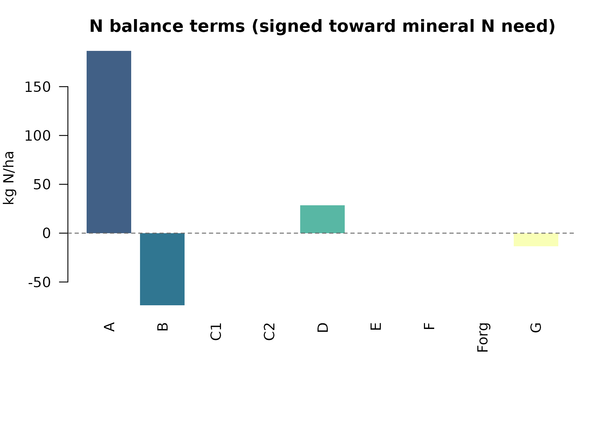
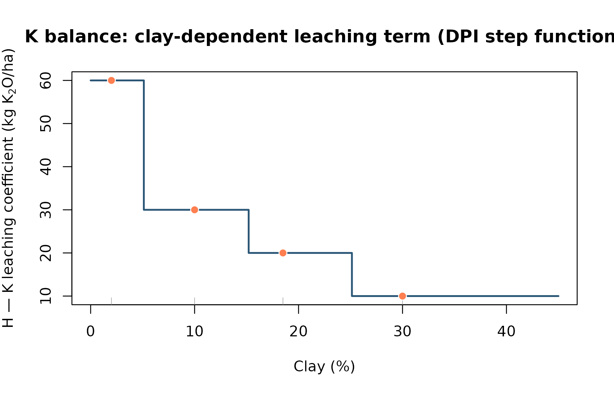
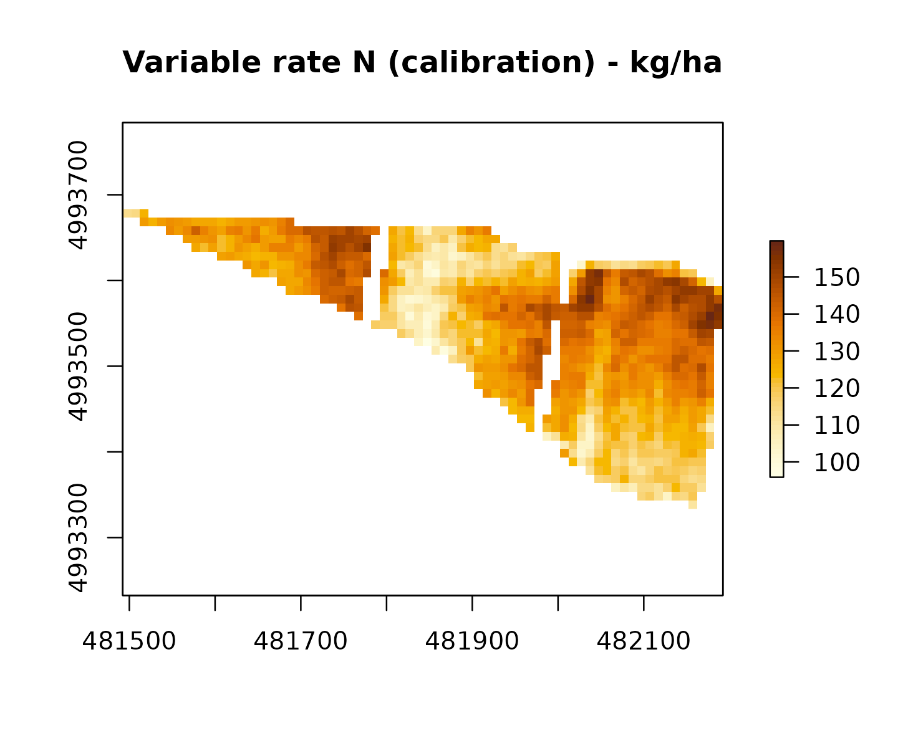
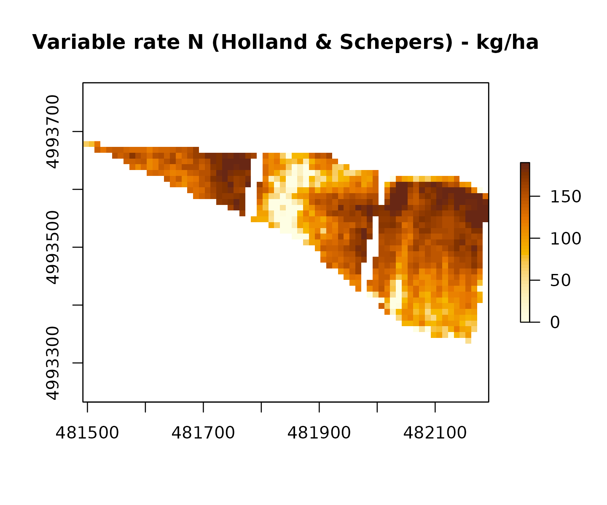
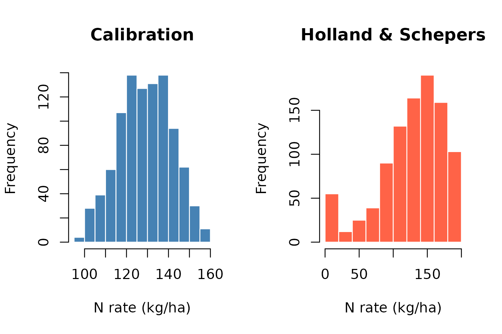

# N, P and K fertilization with NFert — DPI Emilia-Romagna 2026

## Introduction

This vignette shows how to use **NFert 0.6.0** to compute a full
nitrogen, phosphorus and potassium fertilisation plan following the
*Disciplinari di Produzione Integrata* (DPI) Emilia-Romagna 2026. The
package reproduces the logic of the official regional tool **Fert_Office
v1.26** (Febbraio 2026, Regione Emilia-Romagna) and makes it scriptable
in R.

The package implements **two complementary methods**:

1.  **Metodo del bilancio (Allegato 2)**: full nutrient mass balance
    with crop demand, soil supply, losses, previous-crop effects and
    organic contributions. Recommended when detailed soil and climate
    data are available.
2.  **Scheda a dose Standard**: simplified per-crop dose with
    user-selectable decrement and increment factors, capped by MAS
    (Massimali Ammessi di Simulazione). Recommended when soil analyses
    are limited.

The package also provides a **fertilisation distribution plan** and
**end-of-cycle soil P and K estimation** to close the agronomic loop
between planning and recording.

### Normative reference

- **DPI Emilia-Romagna 2026** — Norme Generali, Allegato 2 (metodo del
  bilancio), Allegato 9 (massimali), *Guida alla Fertilizzazione
  Minerale e Organica* (N, P, K).
- **Reg. reg. 2/2024** — limiti MAS.
- **Reg. reg. 3/2017** — utilizzazione agronomica degli effluenti e del
  digestato.
- **Direttiva Nitrati 91/676/CEE** — in ZVN limite di 170 kg N/ha/anno
  da effluenti zootecnici.
- **Reg. UE 2021/2115** — soglie minime di efficienza.

## Naming conventions

NFert mixes English and Italian terminology by design:

- **Function names**: English snake_case (e.g. `N_balance`, `P_balance`,
  `plan_distribution`, `classify_pH`). Three exceptions retain the
  Italian DPI canonical name: `scheda_N`, `scheda_PK`, `get_MAS` /
  `check_MAS`.
- **Parameters**: English snake_case throughout.
- **Class strings** (e.g. “molto bassa”, “media”, “Sabbiosi”) are kept
  in Italian because they are DPI canonical labels.
- **Soil-group labels** are accepted in any of three conventions:
  Italian plural (“Sabbiosi”, “Medio impasto”, “Argillosi e limosi”),
  Italian singular (“Sabbioso”, “Franco”, “Argilloso”) or English
  (“Sandy textures”, “Loamy textures”, “Clay textures”). The
  [`normalise_soil_group()`](https://mcroci.github.io/NFert/reference/normalise_soil_group.md)
  helper canonicalises any of them.

``` r

library(NFert)
normalise_soil_group("Loamy textures")
#> $id_rag
#> [1] 2
#> 
#> $it_plural
#> [1] "Medio impasto"
#> 
#> $it_singular
#> [1] "Franco"
#> 
#> $en
#> [1] "Loamy textures"
normalise_soil_group("Franco")
#> $id_rag
#> [1] 2
#> 
#> $it_plural
#> [1] "Medio impasto"
#> 
#> $it_singular
#> [1] "Franco"
#> 
#> $en
#> [1] "Loamy textures"
resolve_id_rag(clay = 18.5, sand = 15.5)
#> [1] 2
```

## Setup

``` r

# Crop and yield
crop  <- "Durum wheat (whole plant)"
yield <- 6   # t/ha

# Soil (sample: Sabbia 15.5%, Argilla 18.5% -> FL, Medio impasto)
clay   <- 18.5
sand   <- 15.5
Ntot   <- 1.5     # g/kg
SOM    <- 2       # %
CN     <- 7.73
pH     <- 8.3
caco3_tot <- 15   # %
caco3_att <- 6.8  # %
olsen_P   <- 15   # ppm P2O5
K         <- 150  # ppm K2O

# Climate
winter_rain       <- 150
start_spring_rain <- 0

# Management
prev_crop         <- "Maize stalks removed"
location          <- "Plain adjacent to urbanized areas"
soil_seeding      <- "traditional"
greenhouse        <- FALSE
```

The scenario above reproduces the sample cell of
`Fert_Office v1.26 ! Inserimento` and is used as the end-to-end
benchmark of the package.

## Soil characterisation

NFert classifies the soil along the DPI 2026 dimensions. The 3-class
texture grouping (Sabbiosi / Medio impasto / Argillosi e limosi) drives
every subsequent coefficient choice (B, C, D, efficiency, soil weight,
etc.).

``` r

# USDA class + DPI 3-group
soil_props <- calc_soil_group_and_id_rag(clay = clay, sand = sand)
soil_props
#> $soil.group
#> [1] "Loamy textures"
#> 
#> $id_rag
#> [1] 2
#> 
#> $TRI3
#> [1] "FL"

# pH, calcare, SO, CSC
classify_pH(pH)
#> $ID_pH
#> [1] 6
#> 
#> $class
#> [1] "alkaline"
#> 
#> $pH
#> [1] 8.3
classify_carbonate_tot(caco3_tot)
#> $ID
#> [1] 3
#> 
#> $class
#> [1] "Moderately calcareous"
#> 
#> $caco3_tot
#> [1] 15
classify_carbonate_att(caco3_att)
#> $ID
#> [1] 3
#> 
#> $class
#> [1] "High"
#> 
#> $caco3_att
#> [1] 6.8
som_cls <- classify_SOM(SOM = SOM, soil_group = "Medio impasto")
som_cls
#> $rating
#> [1] "medium"
#> 
#> $class
#> [1] "Normal"
#> 
#> $class_it
#> [1] "Normale"
#> 
#> $SOM
#> [1] 2
#> 
#> $soil_group
#> [1] "Loamy textures"

# Maximum annual SO input (for ammendanti)
max_SO_input(som_cls$class)
#> [1] 11
```

## Nitrogen balance (Allegato 2)

The DPI 2026 formula is:

``` math
N_{fert} = A - B + C_1 + C_2 + D - E - F - F_{org} - G
```

where each term is computed by a dedicated function:

| Term | Function | Meaning |
|----|----|----|
| A | [`calc_crop_N_demand()`](https://mcroci.github.io/NFert/reference/calc_crop_N_demand.md) | Crop N demand (kg/ha) |
| B = b1 + b2 | [`soil_fertility()`](https://mcroci.github.io/NFert/reference/soil_fertility.md) | b1 = N pronto from N total, b2 = N mineralised from SOM |
| C1, C2 | [`leaching_loss()`](https://mcroci.github.io/NFert/reference/leaching_loss.md) | Autumn-winter and early-spring leaching |
| D | [`calc_N_immobilization_loss()`](https://mcroci.github.io/NFert/reference/calc_N_immobilization_loss.md) | Microbial immobilisation |
| E | [`nitrogen_from_previous_crop_residues()`](https://mcroci.github.io/NFert/reference/nitrogen_from_previous_crop_residues.md) | Previous-crop residual N |
| F | [`organic_previous_years_N()`](https://mcroci.github.io/NFert/reference/organic_previous_years_N.md) | Residual N from previous years’ organic |
| Forg | [`organic_fertilization()`](https://mcroci.github.io/NFert/reference/organic_fertilization.md) | Current-year organic N, DPI efficiency |
| G | [`natural_contribution()`](https://mcroci.github.io/NFert/reference/natural_contribution.md) | Atmospheric deposition |

### Full computation

``` r

n_bal <- N_balance(
  expected_yield_tons_ha = yield,
  crop = crop,
  ccp  = "Spring-summer crop 100-130 days",
  sand = sand, clay = clay,
  Ntot = Ntot, SOM = SOM, CN = CN,
  oxygen_availability = "Normal",
  winter_rain = winter_rain,
  start_spring_rain = start_spring_rain,
  prev_crop = prev_crop,
  source = "None",
  fertorg_frequency = "every year",
  location = location,
  forg_quantity = 0,
  soil_seeding = soil_seeding,
  greenhouse = greenhouse,
  E_to_D = TRUE        # fold negative E into D, as in foglio Bilancio
)

n_bal
#>       A     B b1    b2 C1 C2     D E F Forg    G surplus_pluviometrico
#> 1 186.6 73.84 39 34.84  0  0 28.46 0 0    0 13.4                 FALSE

# Final dose
n_dose <- calculate_N_fertilization(n_bal)
n_dose
#> [1] 127.82
```

``` r

# Signed terms in N_fert = A - B + C1 + C2 + D - E - F - Forg - G (kg N/ha)
signed <- c(
  A = n_bal$A, B = -n_bal$B, C1 = n_bal$C1, C2 = n_bal$C2, D = n_bal$D,
  E = -n_bal$E, F = -n_bal$F, Forg = -n_bal$Forg, G = -n_bal$G
)
op <- par(mar = c(7, 4, 3, 1))
cols <- grDevices::hcl.colors(length(signed), "BluYl", alpha = 0.9)
barplot(
  as.numeric(signed), names.arg = names(signed), las = 2, col = cols,
  border = NA, ylab = "kg N/ha",
  main = "N balance terms (signed toward mineral N need)"
)
abline(h = 0, lty = 2, col = "gray40")
```



``` r

par(op)
```

The result matches the Fert_Office `Bilancio` sheet: A = 186.6, B =
73.84, D = 39.536 (includes `|E|` = 10), G = 10.05, and **N required ≈
142.25 kg/ha**.

### MAS verification (Massimali Ammessi di Simulazione)

``` r

get_MAS(crop = crop)
#> Warning in get_MAS(crop = crop): Crop 'Durum wheat (whole plant)' not found in
#> MAS table. Return NULL. Use get_MAS() to see available crops.
#> NULL
check_MAS(crop, n_dose)
#> Warning in get_MAS(crop, mas_table): Crop 'Durum wheat (whole plant)' not found
#> in MAS table. Return NULL. Use get_MAS() to see available crops.
#> $ok
#> [1] NA
#> 
#> $mas_N
#> [1] NA
#> 
#> $N_planned
#> [1] 127.82
#> 
#> $message
#> [1] "Crop not found in MAS table; check not performed."
```

``` r

mas_row <- get_MAS(crop = crop)
#> Warning in get_MAS(crop = crop): Crop 'Durum wheat (whole plant)' not found in
#> MAS table. Return NULL. Use get_MAS() to see available crops.
mas_n <- mas_row$mas_N[1]
vals <- c(`Planned N` = n_dose, `MAS N` = mas_n)
bp <- barplot(
  vals, col = grDevices::hcl.colors(2, "Peach", rev = TRUE), border = NA,
  ylab = "kg N/ha", main = "Planned N dose vs maximum allowed (MAS)"
)
text(bp, vals + 0.04 * max(vals, na.rm = TRUE), labels = round(vals, 1), pos = 3, cex = 0.9)
```


### Component functions (pedagogical use)

Every balance term is also exposed as a standalone function for teaching
or advanced scenario analysis:

``` r

demand <- calc_crop_N_demand(expected_yield_tons_ha = yield, crop = crop)
demand
#> $N_requirement
#> [1] 186.6
#> 
#> $units
#> [1] "kg/ha"
#> 
#> $n_fixation_pct
#> [1] 0

fertility <- soil_fertility(Ntot = Ntot, SOM = SOM,
                            soil.group = "Loamy textures", CN = CN,
                            ccp = "Spring-summer crop 100-130 days",
                            soil_seeding = soil_seeding)
fertility
#> $b1
#> [1] 39
#> 
#> $b2
#> [1] 34.84
#> 
#> $units
#> [1] "kg/ha"

leach <- leaching_loss(winter_rain = winter_rain,
                       start_spring_rain = start_spring_rain,
                       oxygen_availability = "Normal",
                       id_rag = soil_props$id_rag,
                       b1 = fertility$b1)
leach
#> $C1
#> [1] 0
#> 
#> $C2
#> [1] 0
#> 
#> $surplus_pluviometrico
#> [1] FALSE

imm <- calc_N_immobilization_loss(B = fertility$b1 + fertility$b2,
                                  oxygen_availability = "Normal",
                                  id_rag = soil_props$id_rag,
                                  greenhouse = greenhouse,
                                  E_residual = -10)   # maize stalks removed
imm
#> [1] 28.46

natural_contribution(location = location,
                     ccp = "Spring-summer crop 100-130 days")
#> [1] 13.4
```

## Phosphorus balance

The phosphorus balance follows the DPI Allegato 2 logic coded in foglio
`Gri_P`:

``` math
P_2O_5 = A_{asp} + B_{1,arric} + A_2 - B_{2,rid}
```

with the *strategia* depending on the soil Olsen class:

- **Molto bassa / bassa**: `Arricchimento` — add $`B_1 = (22.9 -
  P_2O_5^{ppm}) \times w_{30cm}/1000 \times f_{imm}`$ where
  $`f_{imm}=1.6`$.
- **Media / elevata**: `Mantenimento` — apply A = asportazione.
- **Molto elevata**: `Riduzione` — A = 0.

### Olsen classification

``` r

p_cls <- classify_P_olsen(value = olsen_P, unit = "P2O5")
p_cls
#> $value_ppm_P
#> [1] 6.550215
#> 
#> $value_ppm_P2O5
#> [1] 15
#> 
#> $ID_Gri_P
#> [1] 2
#> 
#> $rating
#> [1] "low"
#> 
#> $soil_class
#> [1] "scarso"
#> 
#> $strategy
#> [1] "Arricchimento"
```

### P balance

``` r

p_bal <- P_balance(
  expected_yield_tons_ha = yield, crop = crop,
  olsen_value = olsen_P, olsen_unit = "P2O5",
  clay = clay, sand = sand
)
p_bal
#>      A A_fabbisogno     B1 A2 B2      strategy ID_Gri_P soil_weight_t_ha
#> 1 63.6         63.6 49.296  0  0 Arricchimento        2             3900
#>   P2O5_required
#> 1       112.896
```

In the benchmark scenario (Olsen P = 15 ppm P2O5) the class is “bassa” →
Arricchimento, so:

- $`A = 63.6`$ kg P2O5/ha (asportazione)
- $`B_1 = (22.9 - 15) \times 3900/1000 \times 1.6 = 49.3`$ kg P2O5/ha
- Total **≈ 112.9 kg P2O5/ha**

This matches cell `Bilancio!I33` of Fert_Office.

## Potassium balance

The potassium balance extends the formula with a leaching term **H**
that depends on clay content:

``` math
K_2O = A_{asp} + H + B_{1,arric} + A_2 - B_{2,rid}
```

Classes for K are defined per DPI texture group (`Sabbiosi`,
`Medio impasto`, `Argillosi e limosi`).

### K classification and leaching

``` r

k_cls <- classify_K(value = K, unit = "K2O", soil_group = "Medio impasto")
k_cls
#> $value_ppm_K
#> [1] 124.9995
#> 
#> $value_ppm_K2O
#> [1] 150
#> 
#> $ID_Gri_K
#> [1] 3
#> 
#> $rating
#> [1] "medium"
#> 
#> $strategy
#> [1] "Mantenimento"

# Leaching by clay (step function):
sapply(c(2, 10, 18.5, 30), K_leaching_by_clay)
#> [1] 60 30 20 10
```

``` r

clay_seq <- seq(0, 45, length.out = 300)
h_seq <- vapply(clay_seq, K_leaching_by_clay, numeric(1))
plot(
  clay_seq, h_seq, type = "s", lwd = 2,
  col = grDevices::hcl.colors(1, "Teal"),
  xlab = "Clay (%)",
  ylab = expression("H — K leaching coefficient (kg K"[2]*"O/ha)"),
  main = "K balance: clay-dependent leaching term (DPI step function)"
)
rug(c(2, 10, 18.5, 30), col = "gray55")
points(
  c(2, 10, 18.5, 30), sapply(c(2, 10, 18.5, 30), K_leaching_by_clay),
  pch = 21, bg = "coral", col = "white", cex = 1.2
)
```



### K balance

``` r

k_bal <- K_balance(
  expected_yield_tons_ha = yield, crop = crop,
  k_value = K, k_unit = "K2O",
  clay = clay, sand = sand
)
k_bal
#>       A A_fabbisogno  H B1 A2 B2     strategy ID_Gri_K K2O_required
#> 1 119.4        119.4 20  0  0  0 Mantenimento        3        139.4
```

``` r

npk <- c(
  `N (mineral)` = n_dose,
  `P2O5` = p_bal$P2O5_required,
  `K2O` = k_bal$K2O_required
)
barplot(
  npk, col = grDevices::hcl.colors(3, "Dark 3", alpha = 0.92), border = NA,
  ylab = "kg/ha",
  main = "Recommended N, P2O5 and K2O inputs (benchmark scenario)"
)
```


Scenario: K = 150 ppm K2O is “media” in Medio impasto → Mantenimento. -
$`A = 119.4`$ kg K2O/ha - $`H = 20`$ (clay 18.5% → step “15.1-25.1 →
20”) - Total **= 139.4 kg K2O/ha**

This matches cell `Gri_K!F30` of Fert_Office (A + H).

## Scheda a dose Standard

For contexts with limited soil analyses, DPI 2026 provides a
standard-dose method. NFert mirrors the flag catalogue of `Fert_Office`
`Scheda_N` and `Scheda_PK`.

### Scheda N

The N standard dose is modified by five decrements and five increments,
then capped by MAS.

``` r

# Durum wheat with buried straw + compacted / no-till
scheda_N(
  crop = crop,
  increments = c(straw_burial = 30, compacted_no_till = 10)
)
#> Crop 'Durum wheat (whole plant)' has 2 matching rows; using the first.
#> $crop
#> [1] "Durum wheat (whole plant)"
#> 
#> $phase
#> [1] "nd"
#> 
#> $dose_base
#> [1] 160
#> 
#> $total_decrement
#> [1] 0
#> 
#> $total_increment
#> [1] 40
#> 
#> $dose_recalculated
#> [1] 200
#> 
#> $max_N_dose
#> [1] 200
#> 
#> $dose_final
#> [1] 200
#> 
#> $mas_exceeded
#> [1] FALSE
#> 
#> $units
#> [1] "kg N/ha"
#> 
#> $reference
#> [1] "DPI Emilia-Romagna 2026, Fert_Office v1.26 (Scheda_N)"

# Alfalfa after, yield low
scheda_N(
  crop = crop,
  decrements = c(after_alfalfa_meadow = 60, yield_low = 20),
  increments = c(low_SOM = 20)
)
#> Crop 'Durum wheat (whole plant)' has 2 matching rows; using the first.
#> $crop
#> [1] "Durum wheat (whole plant)"
#> 
#> $phase
#> [1] "nd"
#> 
#> $dose_base
#> [1] 160
#> 
#> $total_decrement
#> [1] 80
#> 
#> $total_increment
#> [1] 20
#> 
#> $dose_recalculated
#> [1] 100
#> 
#> $max_N_dose
#> [1] 200
#> 
#> $dose_final
#> [1] 100
#> 
#> $mas_exceeded
#> [1] FALSE
#> 
#> $units
#> [1] "kg N/ha"
#> 
#> $reference
#> [1] "DPI Emilia-Romagna 2026, Fert_Office v1.26 (Scheda_N)"
```

When the cumulated dose overshoots `max_N_dose`, the function caps it
and flags `mas_exceeded = TRUE`:

``` r

scheda_N(
  crop = crop,
  increments = c(straw_burial = 100, compacted_no_till = 100, low_SOM = 50)
)
#> Crop 'Durum wheat (whole plant)' has 2 matching rows; using the first.
#> $crop
#> [1] "Durum wheat (whole plant)"
#> 
#> $phase
#> [1] "nd"
#> 
#> $dose_base
#> [1] 160
#> 
#> $total_decrement
#> [1] 0
#> 
#> $total_increment
#> [1] 250
#> 
#> $dose_recalculated
#> [1] 410
#> 
#> $max_N_dose
#> [1] 200
#> 
#> $dose_final
#> [1] 200
#> 
#> $mas_exceeded
#> [1] TRUE
#> 
#> $units
#> [1] "kg N/ha"
#> 
#> $reference
#> [1] "DPI Emilia-Romagna 2026, Fert_Office v1.26 (Scheda_N)"
```

### Scheda PK

For P and K the base dose depends on the initial soil dotation class:

``` r

scheda_PK(
  crop = crop,
  soil_P_class = "normal",
  soil_K_class = "normal"
)
#> $crop
#> [1] "Grano duro (pianta intera)"
#> 
#> $phase
#> [1] "nd"
#> 
#> $soil_P_class
#> [1] "normal"
#> 
#> $soil_K_class
#> [1] "normal"
#> 
#> $dose_base_P2O5
#> [1] 60
#> 
#> $P_total_decrement
#> [1] 0
#> 
#> $P_total_increment
#> [1] 0
#> 
#> $dose_final_P2O5
#> [1] 60
#> 
#> $dose_base_K2O
#> [1] 120
#> 
#> $K_total_decrement
#> [1] 0
#> 
#> $K_total_increment
#> [1] 0
#> 
#> $dose_final_K2O
#> [1] 120
#> 
#> $units
#> [1] "kg/ha"
#> 
#> $reference
#> [1] "DPI Emilia-Romagna 2026, Fert_Office v1.26 (Scheda_PK)"

# Example: enrichment under low P dotation
scheda_PK(
  crop = crop,
  soil_P_class = "low",
  soil_K_class = "normal",
  P_increments = c(ristoppio = 20)
)
#> $crop
#> [1] "Grano duro (pianta intera)"
#> 
#> $phase
#> [1] "nd"
#> 
#> $soil_P_class
#> [1] "low"
#> 
#> $soil_K_class
#> [1] "normal"
#> 
#> $dose_base_P2O5
#> [1] 80
#> 
#> $P_total_decrement
#> [1] 0
#> 
#> $P_total_increment
#> [1] 20
#> 
#> $dose_final_P2O5
#> [1] 100
#> 
#> $dose_base_K2O
#> [1] 120
#> 
#> $K_total_decrement
#> [1] 0
#> 
#> $K_total_increment
#> [1] 0
#> 
#> $dose_final_K2O
#> [1] 120
#> 
#> $units
#> [1] "kg/ha"
#> 
#> $reference
#> [1] "DPI Emilia-Romagna 2026, Fert_Office v1.26 (Scheda_PK)"
```

## Fertilisation distribution plan

Once the required N, P, K doses are known, the plan distributes them
across epochs and methods.
[`plan_distribution()`](https://mcroci.github.io/NFert/reference/plan_distribution.md)
accepts:

- A list of organic applications (matrix name from
  `organic_fertilizers.table`, quantity in t/ha, year, modality-epoch
  id, optional efficiency level).
- A list of mineral applications (name from `mineral_fertilizers.table`,
  quantity in q/ha, modality-epoch).
- Optional target doses (for Eccesso/Deficit alerts) and a ZVN flag.

``` r

plan <- plan_distribution(
  soil_group = "Medio impasto",
  n_balance  = n_dose,
  p_balance  = p_bal$P2O5_required,
  k_balance  = k_bal$K2O_required,
  organic_rows = list(
    list(fertilizer    = "letame bovino",
         quantity_t_ha = 20,
         year          = 2025,
         modality_epoch = 1,
         level         = "media")
  ),
  mineral_rows = list(
    list(fertilizer       = "UREA AGRICOLA PRIL.46%",
         quantity_q_ha = 3,
         modality_epoch = 11)
  ),
  zvn = TRUE
)

# Row-by-row plan
plan$rows
#>    source             fertilizer year modality_epoch ID_Mo quantity_t_ha N_kg
#> 1 organic          letame bovino 2025              1     1          20.0  100
#> 2 mineral UREA AGRICOLA PRIL.46%   NA             11    11           0.3  138
#>   P2O5_kg K2O_kg efficiency_pct N_useful P2O5_useful K2O_useful zootec
#> 1      48    140             50       50          48        140   TRUE
#> 2       0      0            100      138           0          0  FALSE
# Cumulated useful nutrients
plan$totals
#>    N_useful P2O5_useful  K2O_useful 
#>         188          48         140
# Target vs delivered alerts
plan$alerts
#> $N
#> [1] "Eccesso"
#> 
#> $P2O5
#> [1] "Deficit"
#> 
#> $K2O
#> [1] "OK"
# ZVN 170 kg N/ha check
plan$zvn_alert
#> [1] "OK ZVN"
```

### Choosing a distribution modality

Modalities are catalogued in `distribution_modalities.table` and their
compatibility with crop cycles in `cycle_modality.table`:

``` r

head(distribution_modalities.table, 12)
#>    ID_Mo                            modality_epoch
#> 1      1        Bare soil, sown the following year
#> 2      2   Straw residues, sown the following year
#> 3      3       At soil preparation, sown same year
#> 4      4                     Top-dress fertigation
#> 5      5        Top-dress low-pressure fertigation
#> 6      6              Top-dress with incorporation
#> 7      7         Top-dress spring no-incorporation
#> 8      8         Top-dress summer no-incorporation
#> 9      9            Straw residues, sown same year
#> 10    10                                Pre-sowing
#> 11    11 Top-dress at full tillering (late winter)
#> 12    12              Top-dress at stem elongation
#>                                               modality_epoch_it
#> 1                Su terreno nudo  e semina nell'anno successivo
#> 2             Su residui pagliosi e semina nell'anno successivo
#> 3      Alla preparazione del terreno e semina nel medesimo anno
#> 4                              In copertura con fertirrigazione
#> 5            In copertura con fertirrigazione a bassa pressione
#> 6                                 In copertura con interramento
#> 7                  In copertura in primavera senza interramento
#> 8                     In copertura in estate senza interramento
#> 9               Su residui pagliosi e semina nel medesimo anno 
#> 10                                                    Presemina
#> 11 In copertura nella fase di pieno accestimento (fine inverno)
#> 12                            In copertura nella fase di levata
```

### Fertiliser sources

Available organic matrices and mineral products:

``` r

# Organic: 21 matrices with their N, P, K and dry-matter titres
head(organic_fertilizers.table[, c("fertilizer", "avg_dm", "avg_N",
                               "avg_P2O5", "avg_K2O", "fully_zootec")], 10)
#>                                         fertilizer avg_dm avg_N avg_P2O5
#> 1                                          compost     65    12      9.0
#> 2      Whole digestate (biomass / cattle effluent)     22     6      4.0
#> 3            Whole digestate (mostly pig effluent)     22     6      4.0
#> 4        Whole digestate (mostly poultry effluent)     22     6      4.0
#> 5                     Clarified digestate fraction      4     8      3.0
#> 6                         Solid digestate fraction     35     5      5.0
#> 7      Humofort pellet (natural organic amendment)     65    18     10.0
#> 8                        Mixed composted amendment     65    18     12.0
#> 9  Humoscam pellet (fermented vegetable amendment)     65    20     30.0
#> 10                                   Cattle manure     25     5      2.4
#>    avg_K2O fully_zootec
#> 1       10        FALSE
#> 2        7        FALSE
#> 3        7        FALSE
#> 4        7        FALSE
#> 5        7        FALSE
#> 6        7        FALSE
#> 7       10        FALSE
#> 8       13        FALSE
#> 9       16        FALSE
#> 10       7         TRUE

# Mineral: 146 commercial fertilisers
head(mineral_fertilizers.table, 10)
#>    ID_min                            fertilizer    N P2O5  K2O
#> 1       1                               Nessuno  0.0    0  0.0
#> 2       2                   Acido fosforico 85%  0.0   61  0.0
#> 3       3           AGRESTE  ORG.MIN. 7,5/12/21  7.5   12 21.0
#> 4       4  AGROFERT MB   ORG.MIN. 10/5/15 +2+16 10.0    5 15.0
#> 5       5 AGROFERT MBS   O.MIN. 9,5/5/14,5+2+24  9.5    5 14.5
#> 6       6                    AZO TOP   18,5/0/0 18.5    0  0.0
#> 7       7                AZO TOP   18,5/0/0 +32 18.5    0  0.0
#> 8       8                 Azogold 40 N + 12 SO3 40.0    0  0.0
#> 9       9                 Azoplus 35 N + 22 SO3 35.0    0  0.0
#> 10     10          BELFRUTTO MB   5/10/15 +5+16  5.0   10 15.0
```

### DPI 2026 organic N efficiency

The N efficiency of organic fertilisers depends on the soil group (3
classes), the dose level (bassa / media / alta), the sector (avi, bov,
sui, dig_tq, dig_sui, dig_avi, dig_chi, fanghi) and the modality level.
The full matrix has 220 entries:

``` r

# Medium impasto, dose media (125-249 kg N/ha), bovino:
efficiency.table[
  efficiency.table$ID_Rag == 2 &
    efficiency.table$ID_Liv == 2 &
    efficiency.table$sector_id == "bov",
]
#>     ID_Rag ID_Liv sector_id ID_N_org efficiency_pct
#> 77       2      2       bov        1          44.20
#> 101      2      2       bov        2          40.80
#> 125      2      2       bov        3          36.55
```

## End-of-cycle soil dotation

After the plan is executed, NFert estimates the residual soil P and K in
ppm, usable as input for the following year’s calculation:

``` r

P_end <- estimate_soil_P_end_of_cycle(
  P2O5_start_ppm = olsen_P,
  P2O5_applied   = plan$totals["P2O5_useful"],
  P2O5_removed   = p_bal$A_fabbisogno,
  soil_group     = "Medio impasto"
)
P_end
#> P2O5_useful 
#>        12.5

K_end <- estimate_soil_K_end_of_cycle(
  K2O_start_ppm = K,
  K2O_applied   = plan$totals["K2O_useful"],
  K2O_removed   = k_bal$A_fabbisogno,
  clay_pct      = clay,
  soil_group    = "Medio impasto"
)
K_end
#> K2O_useful 
#>   150.1538
```

## Alternative scenario: maize (forage, irrigated)

A second scenario with different crop, cycle, irrigation and
precessione.

``` r

mais_bal <- N_balance(
  expected_yield_tons_ha = 15,
  crop = "Silage maize (class 700)",
  ccp  = "Spring-summer crop 100-130 days",
  sand = 50, clay = 30,
  Ntot = 1.2, SOM = 1.6, CN = 10,
  oxygen_availability = "Normal",
  winter_rain = 260, start_spring_rain = 40,
  prev_crop = "Winter cereals straw removal",
  source = "Cattle slurry",
  fertorg_frequency = "every year",
  location = "Isolated plain",
  forg_quantity = 80,
  soil_seeding = "traditional"
)
mais_bal
#>      A      B   b1     b2   C1 C2      D E F   Forg     G surplus_pluviometrico
#> 1 58.5 56.928 31.2 25.728 31.2  0 24.232 0 0 159.12 10.05                  TRUE
calculate_N_fertilization(mais_bal)
#> [1] 0
```

## Alternative scenario: apple orchard in piena produzione

``` r

apple_n <- N_balance(
  expected_yield_tons_ha = 40,
  crop = "Melo frutti, legno e foglie",
  ccp  = "In production",
  sand = 40, clay = 30,
  Ntot = 1.8, SOM = 2.5, CN = 9,
  oxygen_availability = "Normal",
  winter_rain = 220, start_spring_rain = 30,
  prev_crop = "Undefined",
  source = "None", fertorg_frequency = "every year",
  location = "Hill or mountain",
  forg_quantity = 0
)
apple_n
#>     A     B   b1 b2    C1 C2    D E F Forg  G surplus_pluviometrico
#> 1 116 106.8 46.8 60 32.76  3 26.7 0 0    0 10                 FALSE
calculate_N_fertilization(apple_n)
#> [1] 61.66

apple_p <- P_balance(expected_yield_tons_ha = 40,
                     crop = "Melo frutti, legno e foglie",
                     olsen_value = 25, olsen_unit = "P2O5",
                     clay = 30, sand = 40)
apple_p
#>    A A_fabbisogno B1 A2 B2     strategy ID_Gri_P soil_weight_t_ha P2O5_required
#> 1 32           32  0  0  0 Mantenimento        3             3900            32

apple_k <- K_balance(expected_yield_tons_ha = 40,
                     crop = "Melo frutti, legno e foglie",
                     k_value = 180, k_unit = "K2O",
                     clay = 30, sand = 40)
apple_k
#>   A A_fabbisogno  H B1 A2 B2  strategy ID_Gri_K K2O_required
#> 1 0          124 10  0  0  0 Riduzione        4            0
```

## Precision agriculture: variable-rate from balance + NDVI

NFert bridges the **agronomic balance** (constant-rate dose, kg/ha) with
**NDVI-based variable-rate application**. The integration logic is:

1.  Compute the **field-average dose** with
    [`N_balance()`](https://mcroci.github.io/NFert/reference/N_balance.md) +
    [`calculate_N_fertilization()`](https://mcroci.github.io/NFert/reference/calculate_N_fertilization.md)
    or
    [`scheda_N()`](https://mcroci.github.io/NFert/reference/dose_standard_N.md).

2.  Use NDVI as a proxy of crop vigour: low NDVI → more N (rescue), high
    NDVI → less N (already vigorous).

3.  Apply one of the two NFert variable-rate algorithms:

    - **Calibration curve**
      ([`estimate_N_rate_from_calibration_curve()`](https://mcroci.github.io/NFert/reference/estimate_N_rate_from_calibration_curve.md)):
      two-point or three-point linear interpolation between observed
      NDVI extremes and user-defined N rates.
    - **Holland & Schepers**
      ([`estimate_N_rate_from_holland_schepers()`](https://mcroci.github.io/NFert/reference/estimate_N_rate_from_holland_schepers.md)):
      sufficiency-index method using the q95 NDVI as reference and a
      base N rate.

The wrapper
[`variable_rate_N()`](https://mcroci.github.io/NFert/reference/variable_rate_N.md)
glues balance and NDVI in one call, preserves the field-average dose by
rescaling and (optionally) caps each pixel at the MAS limit.

### Example: variable-rate N for grano duro

``` r

library(raster)
#> Loading required package: sp

# NDVI raster: example from NFert (RasterLayer or multi-band stack; functions use the NDVI layer if named)
data(s2.rast)
ndvi <- s2.rast
ndvi
#> class      : RasterBrick 
#> dimensions : 35, 70, 2450, 5  (nrow, ncol, ncell, nlayers)
#> resolution : 10, 10  (x, y)
#> extent     : 481492.3, 482192.3, 4993333, 4993683  (xmin, xmax, ymin, ymax)
#> crs        : +proj=utm +zone=32 +ellps=WGS84 +towgs84=0,0,0,0,0,0,0 +units=m +no_defs 
#> source     : memory
#> names      :    B02,    B03,    B04,    B05,    B08 
#> min values : 0.0548, 0.0874, 0.0529, 0.1214, 0.2989 
#> max values : 0.0928, 0.1356, 0.1138, 0.1793, 0.4632
```

``` r

# Field-average N from the balance
n_dose                 # ~142 kg/ha (computed earlier in this vignette)
#> [1] 127.82

# Variable-rate via two-point calibration; envelope of +/-25%
vr_cal <- variable_rate_N(
  ndvi_raster = ndvi,
  n_dose      = n_dose,
  method      = "calibration",
  envelope    = 0.25,
  mas_cap     = 190     # MAS for grano duro (RR 2/2024)
)

vr_cal$mean_kg_ha       # ~ n_dose
#> [1] 128.9633
vr_cal$min_kg_ha
#> [1] 95.865
vr_cal$max_kg_ha
#> [1] 159.775

raster::plot(vr_cal$rate_raster,
             main = "Variable rate N (calibration) - kg/ha",
             col  = grDevices::hcl.colors(50, "YlOrBr", rev = TRUE))
```



### Example: Holland & Schepers method

``` r

vr_hs <- variable_rate_N(
  ndvi_raster = ndvi,
  n_dose      = n_dose,
  method      = "holland",
  mas_cap     = 190
)

vr_hs$mean_kg_ha
#> [1] 127.4532
raster::plot(vr_hs$rate_raster,
             main = "Variable rate N (Holland & Schepers) - kg/ha",
             col  = grDevices::hcl.colors(50, "YlOrBr", rev = TRUE))
```



### Comparison and aggregation

``` r

# Total N applied to the field (assuming each pixel has the same area)
mean(getValues(vr_cal$rate_raster), na.rm = TRUE)
#> [1] 128.9633
mean(getValues(vr_hs$rate_raster),  na.rm = TRUE)
#> [1] 127.4532

# Histogram comparison
oldpar <- par(mfrow = c(1, 2))
hist(getValues(vr_cal$rate_raster), main = "Calibration",
     xlab = "N rate (kg/ha)", col = "steelblue", border = "white")
hist(getValues(vr_hs$rate_raster),  main = "Holland & Schepers",
     xlab = "N rate (kg/ha)", col = "tomato",   border = "white")
```



``` r

par(oldpar)
```

### Linking to the distribution plan

The variable-rate raster can be coupled to a single fertiliser
application (typically the **copertura**) inside
[`plan_distribution()`](https://mcroci.github.io/NFert/reference/plan_distribution.md):
read the mean rate from the raster and pass it as the mineral row.

``` r

mean_rate <- vr_cal$mean_kg_ha
# Quintals/ha of UREA needed to deliver mean_rate (titre 46% N)
q_urea_per_ha <- mean_rate / 46

plan_vr <- plan_distribution(
  soil_group = "Medio impasto",
  n_balance  = n_dose, p_balance = 0, k_balance = 0,
  organic_rows = list(),
  mineral_rows = list(
    list(fertilizer       = "UREA AGRICOLA PRIL.46%",
         quantity_q_ha = q_urea_per_ha,
         modality_epoch = 11)            # In copertura - pieno accestimento
  )
)
plan_vr$rows
#>    source             fertilizer year modality_epoch ID_Mo quantity_t_ha
#> 1 mineral UREA AGRICOLA PRIL.46%   NA             11    11     0.2803549
#>       N_kg P2O5_kg K2O_kg efficiency_pct N_useful P2O5_useful K2O_useful zootec
#> 1 128.9633       0      0            100 128.9633           0          0  FALSE
plan_vr$totals
#>    N_useful P2O5_useful  K2O_useful 
#>    128.9633      0.0000      0.0000
```

### Three-point calibration (advanced)

For more refined NDVI-rate relationships you can call the underlying
estimator directly, providing a `meanN` for the average NDVI:

``` r

n_rate_3pt <- estimate_N_rate_from_calibration_curve(
  raster = ndvi,
  minN = 100, meanN = 140, maxN = 180,
  calibration_type = "three-point"
)
raster::cellStats(n_rate_3pt, summary)
#>    Min. 1st Qu.  Median    Mean 3rd Qu.    Max.     NAs 
#>   99.54  129.84  141.21  140.95  152.36  179.51    1481
```

## Reference tables

NFert exposes 33 internal tables; the most useful in day-to-day work:

``` r

# Crop master list
head(uptake_table[, c("crop_id", "crop", "N", "P2O5", "K2O",
                              "reference_yield")], 5)
#>   crop_id                                              crop    N      P2O5
#> 1      A2  Kiwifruit (green flesh) - fruit, wood and leaves 0.59 0.1600000
#> 2     Ab2 Kiwifruit (yellow flesh) - fruit, wood and leaves 0.59 0.1600000
#> 3      A4   Apricot (medium yield) - fruit, wood and leaves 0.55 0.1300000
#> 4      A5     Apricot (high yield) - fruit, wood and leaves 0.55 0.1300000
#> 5      A6        Other fruit trees - fruit, wood and leaves 0.33 0.2838462
#>         K2O reference_yield
#> 1 0.5900000              25
#> 2 0.5900000              30
#> 3 0.5300000              13
#> 4 0.5000000              18
#> 5 0.7411538              NA

# MAS (massimali) 2026
head(mas.table[, c("crop_id", "crop", "MAS_N", "standard_N",
                           "max_N_dose")], 5)
#>   crop_id                                              crop MAS_N standard_N
#> 1      A2  Kiwifruit (green flesh) - fruit, wood and leaves   150        120
#> 2     Ab2 Kiwifruit (yellow flesh) - fruit, wood and leaves   150        150
#> 3      A4   Apricot (medium yield) - fruit, wood and leaves   135         75
#> 4      A5     Apricot (high yield) - fruit, wood and leaves   135        100
#> 5      A6        Other fruit trees - fruit, wood and leaves    NA         NA
#>   max_N_dose
#> 1        160
#> 2        190
#> 3        125
#> 4        150
#> 5         NA

# Gri_P and Gri_K classes
p_availability.table
#>   ID_Gri_P min_P_ppm max_P_ppm min_P2O5_ppm max_P2O5_ppm    rating
#> 1        1         0         5         0.00        11.45  very low
#> 2        2         5        10        11.45        22.90       low
#> 3        3        10        15        22.90        34.35    medium
#> 4        4        15        30        34.35        68.70      high
#> 5        5        30       999        68.70      2287.71 very high
#>        rating_it        class
#> 1    molto bassa molto scarso
#> 2          bassa       scarso
#> 3          media      normale
#> 4        elevata      normale
#> 5  molto elevata   molto alto
k_availability.table
#>    ID_Gri_K          group           group_it min_K_ppm max_K_ppm min_K2O_ppm
#> 1         1 Sandy textures           Sabbiosi         0        40           0
#> 2         2 Sandy textures           Sabbiosi        40        80          48
#> 3         3 Sandy textures           Sabbiosi        80       120          96
#> 4         4 Sandy textures           Sabbiosi       120       999         144
#> 5         5 Loamy textures      Medio impasto         0        60           0
#> 6         6 Loamy textures      Medio impasto        60       100          72
#> 7         7 Loamy textures      Medio impasto       100       150         120
#> 8         8 Loamy textures      Medio impasto       150       999         180
#> 9         9  Clay textures Argillosi e limosi         0        80           0
#> 10       10  Clay textures Argillosi e limosi        80       120          96
#> 11       11  Clay textures Argillosi e limosi       120       180         144
#> 12       12  Clay textures Argillosi e limosi       180       999         216
#>    max_K2O_ppm   rating   rating_it ID_Dot_K
#> 1         48.0 very low molto bassa        1
#> 2         96.0      low       bassa        2
#> 3        144.0   medium       media        3
#> 4       1198.8     high     elevata        4
#> 5         72.0 very low molto bassa        1
#> 6        120.0      low       bassa        2
#> 7        180.0   medium       media        3
#> 8       1198.8     high     elevata        4
#> 9         96.0 very low molto bassa        1
#> 10       144.0      low       bassa        2
#> 11       216.0   medium       media        3
#> 12      1198.8     high     elevata        4

# Texture grouping with soil weights
texture_groups.table
#>            group group_canonical_it group_singular_it ID_Rag specific_weight
#> 1  Clay textures Argillosi e limosi         Argilloso      3             1.2
#> 2 Sandy textures           Sabbiosi          Sabbioso      1             1.4
#> 3 Loamy textures      Medio impasto            Franco      2             1.3
#>   P_immobilisation_factor soil_weight_20cm soil_weight_30cm soil_weight_40cm
#> 1                     1.4             2400             3600             4800
#> 2                     1.2             2800             4200             5600
#> 3                     1.3             2600             3900             5200
#>   soil_weight_50cm
#> 1             6000
#> 2             7000
#> 3             6500
```

## Notes and limitations

- The package implements the Italian DPI Emilia-Romagna specification.
  Coefficients and thresholds differ from other Italian regions or
  national standards.
- The
  [`plan_distribution()`](https://mcroci.github.io/NFert/reference/plan_distribution.md)
  function checks totals vs balance targets and the ZVN 170 kg N/ha
  limit, but does not yet check MAS per single application nor the
  specific modality-cycle DPI constraints (`cycle_modality.table`). A
  future release will add these checks.
- The `s2.rast` dataset is a minimal Sentinel-2 NDVI raster used only
  for vignettes and examples; for production use, replace it with your
  own NDVI raster (Sentinel-2, drone, or any other source) at the
  desired resolution.
- [`variable_rate_N()`](https://mcroci.github.io/NFert/reference/variable_rate_N.md)
  re-scales the raster so the field-average matches the agronomic dose;
  if you instead want to allow the mean to drift (e.g. when upper/lower
  envelopes are explicitly chosen), use the underlying
  [`estimate_N_rate_from_calibration_curve()`](https://mcroci.github.io/NFert/reference/estimate_N_rate_from_calibration_curve.md)
  /
  [`estimate_N_rate_from_holland_schepers()`](https://mcroci.github.io/NFert/reference/estimate_N_rate_from_holland_schepers.md)
  directly.
- For crops with multiple phases (e.g. grano duro with fase nd), the MAS
  lookup uses the first matching row; pass `phase = ...` explicitly when
  ambiguity matters.

## Session info

``` r

sessionInfo()
#> R version 4.6.0 (2026-04-24)
#> Platform: x86_64-pc-linux-gnu
#> Running under: Ubuntu 24.04.4 LTS
#> 
#> Matrix products: default
#> BLAS:   /usr/lib/x86_64-linux-gnu/openblas-pthread/libblas.so.3 
#> LAPACK: /usr/lib/x86_64-linux-gnu/openblas-pthread/libopenblasp-r0.3.26.so;  LAPACK version 3.12.0
#> 
#> locale:
#>  [1] LC_CTYPE=C.UTF-8       LC_NUMERIC=C           LC_TIME=C.UTF-8       
#>  [4] LC_COLLATE=C.UTF-8     LC_MONETARY=C.UTF-8    LC_MESSAGES=C.UTF-8   
#>  [7] LC_PAPER=C.UTF-8       LC_NAME=C              LC_ADDRESS=C          
#> [10] LC_TELEPHONE=C         LC_MEASUREMENT=C.UTF-8 LC_IDENTIFICATION=C   
#> 
#> time zone: UTC
#> tzcode source: system (glibc)
#> 
#> attached base packages:
#> [1] stats     graphics  grDevices utils     datasets  methods   base     
#> 
#> other attached packages:
#> [1] raster_3.6-32 sp_2.2-1      NFert_0.14.0 
#> 
#> loaded via a namespace (and not attached):
#>  [1] jsonlite_2.0.0     compiler_4.6.0     Rcpp_1.1.1-1.1     jquerylib_0.1.4   
#>  [5] systemfonts_1.3.2  textshaping_1.0.5  yaml_2.3.12        fastmap_1.2.0     
#>  [9] lattice_0.22-9     R6_2.6.1           classInt_0.4-11    sf_1.1-1          
#> [13] knitr_1.51         htmlwidgets_1.6.4  desc_1.4.3         units_1.0-1       
#> [17] DBI_1.3.0          bslib_0.10.0       rlang_1.2.0        cachem_1.1.0      
#> [21] terra_1.9-25       xfun_0.57          fs_2.1.0           sass_0.4.10       
#> [25] otel_0.2.0         cli_3.6.6          pkgdown_2.2.0      class_7.3-23      
#> [29] digest_0.6.39      grid_4.6.0         lifecycle_1.0.5    KernSmooth_2.23-26
#> [33] proxy_0.4-29       evaluate_1.0.5     codetools_0.2-20   ragg_1.5.2        
#> [37] e1071_1.7-17       rmarkdown_2.31     tools_4.6.0        htmltools_0.5.9
```
