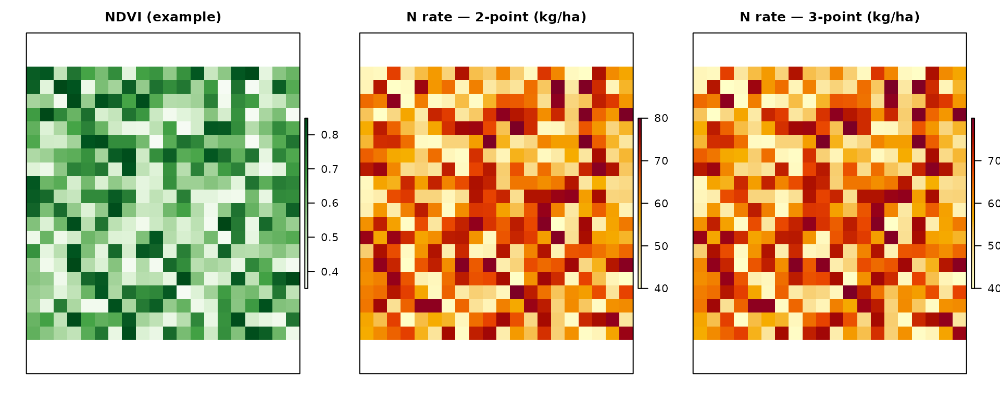
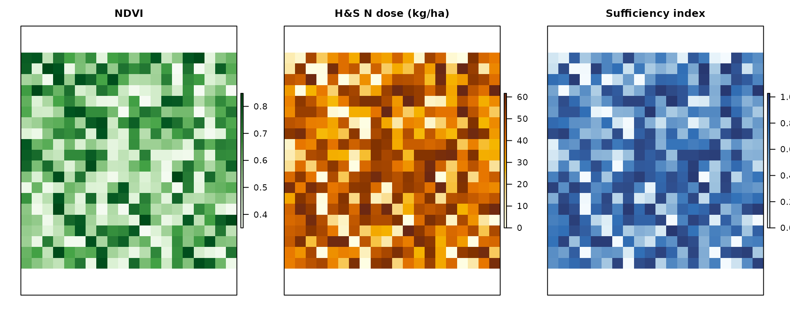

# Nitrogen Fertilization Management with NFert: A Comprehensive Guide

## Introduction

The **NFert** R package provides a comprehensive toolkit for calculating
nitrogen fertilization requirements in field crops following the
Emilia-Romagna Regional Recommendations for integrated production. This
vignette demonstrates how to use NFert for nitrogen balance
calculations, soil fertility assessment, and precision agriculture
applications.

### What is Nitrogen Balance?

Nitrogen balance is a quantitative method that accounts for all nitrogen
inputs and outputs in an agricultural system. The general equation used
in NFert is:

``` math
\text{Nitrogen Fertilization (N)} = A - B + C1 + C2 + D - E - F_{org} - G
```

Where:

- **A**: Crop nitrogen requirements (kg/ha)
- **B**: Soil nitrogen supply (sum of b1 and b2) (kg/ha)
- **C1**: Nitrogen leaching loss in winter (kg/ha)
- **C2**: Nitrogen leaching loss in spring (kg/ha)
- **D**: Immobilization and dispersion losses (kg/ha)
- **E**: Nitrogen from previous crop residues (kg/ha)
- **F\_{org}**: Nitrogen from organic fertilizers (kg/ha)
- **G**: Natural nitrogen contributions (kg/ha)

### Normative framework: DPI 2025–2026 and FertDPI

NFert implements the **method of the balance** (Allegato 2) of the
Disciplinari di Produzione Integrata (DPI) Emilia-Romagna, in line with
the *Guida alla Fertilizzazione Minerale e Organica* (DPI 2025) and the
regional tool **FertDPI / Fert_Office**. References: DPI Norme Generali
(Allegato 2, 3, 4, 6, 7, 9), Reg. reg. 2/2024 and 3/2017, Direttiva
Nitrati (91/676/CEE). In **Zone Vulnerabili ai Nitrati (ZVN)** the MAS
(limiti di massima applicazione standard) are binding and the 170 kg
N/ha/year ceiling from livestock effluents applies at farm level.

**Formula N (Guida DPI 2025):**  
N da apportare = **A** − **B** + **C** + **D** − **E** − **F** − **G**

- **A** = Fabbisogni colturali (assorbimenti unitari × produzione
  attesa).  
- **B** = Fertilità del suolo: **B1** (mineralizzazione S.O.:
  coefficiente × S.O. % × coefficiente tempo) + **B2** (azoto pronto:
  coefficiente × N totale ‰; solo colture con ciclo \< 1 anno). Per
  pluriennali B = B1 soltanto.  
- **C** = Perdite per lisciviazione: **Ca** (autunno-inverno: \<150 mm
  nessuna; 150–250 mm perdita progressiva; \>250 mm tutto l’N pronto) +
  **Cb** (febbraio: 1 kg N/ha ogni 10 mm oltre 250 mm cumulati).  
- **D** = Immobilizzazione e dispersione = B × fattore di correzione
  *fc* (in funzione di ossigeno e tessitura: es. buona 0,15–0,25,
  moderata 0,20–0,30, impedita 0,30–0,40).  
- **E** = N da residui della precessione (tabella: cereali paglia
  asportata −10, interrata −30; medica +80; soia 0; leguminose da
  granella +40; ecc.).  
- **F** = N da fertilizzazioni organiche anni precedenti (ammendanti
  50/30/20 %; Cattle slurry 30/15/10; suino/pollina 15/10/5).  
- **G** = Apporti naturali (precipitazioni; fissazione per leguminose).

NFert computes the balance and subtracts the current-year organic N
(Forg) to obtain the mineral N to apply. Fractioning rules (max 100
kg/ha N per intervention for herbaceous crops, 60 kg/ha for tree crops;
min 7 days between interventions) and presemina/autumn caps (e.g. max 30
kg/ha presemina, max 40 kg/ha arboree before 15 Oct) are set by DPI and
must be respected in the field plan.

**Soil texture (DPI groupings):** The 12 USDA texture classes are
grouped into three macro-categories used for efficiency and
coefficients: (1) *Tendenzialmente sabbioso* (S, SF, FS), (2) *Franco /
Medio impasto* (L, F, FL, FSA, FA), (3) *Tendenzialmente argilloso*
(FLA, AS, AL, A). NFert’s
[`tri3()`](https://mcroci.github.io/NFert/reference/tri3.md) and
[`calc_soil_group_and_id_rag()`](https://mcroci.github.io/NFert/reference/calc_soil_group_and_id_rag.md)
provide texture and soil group.

**Maximum allowed doses (MAS):** Each crop has a ceiling for N and P₂O₅
that must not be exceeded. Use `get_MAS(crop)` and
`check_MAS(crop, N_planned)` to retrieve and check against MAS (see
section below).

**Organic N efficiency (DPI):** The share of organic N available to the
crop in the year of application depends on fertilizer type,
**distribution technique** (efficient / medium / low), and **soil
texture**. Efficient = injection, fertigation, incorporation within 4 h;
medium = band spreading with quick incorporation; low = surface
spreading without incorporation. Ammendanti compostati use a fixed 40%
efficiency. NFert’s
[`organic_fertilization()`](https://mcroci.github.io/NFert/reference/organic_fertilization.md)
uses factors by source and frequency; for DPI-specific efficiency by
soil and distribution, refer to the FertDPI ‘Efficienza’ sheet or the
regional guide.

### Package Overview

NFert provides the following categories of functions:

1.  **Field-scale nitrogen balance** -
    [`N_balance()`](https://mcroci.github.io/NFert/reference/N_balance.md)
    plus the ten component helpers (crop demand, soil supply, leaching,
    immobilisation, previous-crop residue, organic contributions,
    natural deposition).
2.  **Phosphorus and potassium balance** -
    [`P_balance()`](https://mcroci.github.io/NFert/reference/P_balance.md),
    [`K_balance()`](https://mcroci.github.io/NFert/reference/K_balance.md).
3.  **Distribution plan** -
    [`plan_distribution()`](https://mcroci.github.io/NFert/reference/plan_distribution.md)
    with MAS and 170 kg N ZVN checks.
4.  **Precision agriculture** -
    [`variable_rate_N()`](https://mcroci.github.io/NFert/reference/variable_rate_N.md),
    [`estimate_N_rate_from_calibration_curve()`](https://mcroci.github.io/NFert/reference/estimate_N_rate_from_calibration_curve.md)
    and
    [`estimate_N_rate_from_holland_schepers()`](https://mcroci.github.io/NFert/reference/estimate_N_rate_from_holland_schepers.md)
    for VI-based VRT;
    [`build_strip_prescription()`](https://mcroci.github.io/NFert/reference/build_strip_prescription.md)
    for machine-width strips along an A-B line;
    [`export_prescription()`](https://mcroci.github.io/NFert/reference/export_prescription.md)
    /
    [`export_prescription_all()`](https://mcroci.github.io/NFert/reference/export_prescription_all.md)
    for Shapefile, GeoJSON, KML, GeoPackage, John Deere, Trimble and
    ISOXML TASKDATA formats.
5.  **Remote-sensing diagnosis** -
    [`compute_vi()`](https://mcroci.github.io/NFert/reference/compute_vi.md)
    (six VIs),
    [`compute_NNI()`](https://mcroci.github.io/NFert/reference/compute_NNI.md)
    /
    [`compute_NNI_from_S2()`](https://mcroci.github.io/NFert/reference/compute_NNI_from_S2.md)
    /
    [`crop_params_NNI()`](https://mcroci.github.io/NFert/reference/crop_params_NNI.md)
    for the GPR-based pipeline,
    [`nni_from_vi_empirical()`](https://mcroci.github.io/NFert/reference/nni_from_vi_empirical.md)
    for the single-VI regression path,
    [`estimate_biophysical()`](https://mcroci.github.io/NFert/reference/estimate_biophysical.md)
    for canopy trait retrieval.
6.  **Farm-level workflow** -
    [`farm_balance()`](https://mcroci.github.io/NFert/reference/farm_balance.md)
    iterates
    [`N_balance()`](https://mcroci.github.io/NFert/reference/N_balance.md)
    over every feature of a GeoJSON / Shapefile and returns an enriched
    `sf` layer ready for export.
7.  **Shiny application** -
    [`run_app()`](https://mcroci.github.io/NFert/reference/run_app.md)
    opens a six-tab web interface with interactive forms, leaflet maps
    and one-click export.

## Installation and Setup

``` r

# If not already installed
# install.packages("NFert")

# Load the package
library(NFert)

# For precision agriculture functions, also load raster
library(raster)
```

## Getting Started: A Simple Example

Let’s start with a basic example calculating the nitrogen balance for a
wheat crop:

``` r

# Calculate nitrogen balance for winter wheat
wheat_balance <- N_balance(
  expected_yield_tons_ha = 8,
  crop = "Soft wheat FF - strong (grain)",
  ccp = "Autumn-winter crop <150 days",
  sand = 30,
  clay = 25,
  Ntot = 1.2,
  SOM = 2.0,
  CN = 9,
  oxygen_availability = "Normal",
  winter_rain = 160,
  start_spring_rain = 40,
  prev_crop = "Winter cereals straw removal",
  source = "Cattle slurry",
  fertorg_frequency = "every year",
  location = "Plain adjacent to urbanized areas",
  forg_quantity = 100
)

# Display results
print(wheat_balance)
#>       A    B   b1 b2 C1   C2    D E F Forg  G surplus_pluviometrico
#> 1 248.8 55.2 31.2 24 30 3.12 23.8 0 0  0.3 10                 FALSE

# Calculate final nitrogen requirement
required_N <- calculate_N_fertilization(wheat_balance)
cat("\nRequired nitrogen fertilization:", round(required_N, 2), "kg/ha\n")
#> 
#> Required nitrogen fertilization: 240.22 kg/ha
```

## Understanding the Nitrogen Balance Components

### Component 1: Crop Nitrogen Demand (A)

The crop nitrogen demand is calculated based on expected yield and
crop-specific nitrogen uptake coefficients:

``` r

# Calculate crop nitrogen demand
crop_demand <- calc_crop_N_demand(
  expected_yield_tons_ha = 10,
  crop = "Soft wheat FF - strong (grain)"
)

print(crop_demand)
#> $N_requirement
#> [1] 311
#> 
#> $units
#> [1] "kg/ha"
#> 
#> $n_fixation_pct
#> [1] 0

# Available crops in the database
head(NFert::uptake_table, 10)
#>    id crop_id                                              crop    N      P2O5
#> 1   1      A2  Kiwifruit (green flesh) - fruit, wood and leaves 0.59 0.1600000
#> 2   2     Ab2 Kiwifruit (yellow flesh) - fruit, wood and leaves 0.59 0.1600000
#> 3   3      A4   Apricot (medium yield) - fruit, wood and leaves 0.55 0.1300000
#> 4   4      A5     Apricot (high yield) - fruit, wood and leaves 0.55 0.1300000
#> 5   5      A6        Other fruit trees - fruit, wood and leaves 0.33 0.2838462
#> 6   6      A8                   Orange - fruit, wood and leaves 0.28 0.1300000
#> 7   7     A10                             Chestnut (fruit only) 0.84 0.3300000
#> 8   8     A12                   Cherry - fruit, wood and leaves 0.67 0.2200000
#> 9   9     A14               Clementine - fruit, wood and leaves 0.28 0.1300000
#> 10 10     A15                   Quince (fruit, wood and leaves) 0.33 0.0800000
#>          K2O balance reference_yield std_N_demand std_P2O5_demand
#> 1  0.5900000      sì              25        147.5            40.0
#> 2  0.5900000      sì              30        177.0            48.0
#> 3  0.5300000      sì              13         71.5            16.9
#> 4  0.5000000      sì              18         99.0            23.4
#> 5  0.7411538      sì              NA           NA              NA
#> 6  0.3900000      sì              30         84.0            39.0
#> 7  0.8600000      sì              NA           NA              NA
#> 8  0.5900000      sì               9         60.3            19.8
#> 9  0.4300000      sì              25         70.0            32.5
#> 10 0.3300000      sì              60        198.0            48.0
#>    std_K2O_demand harvested_part
#> 1           147.5         frutti
#> 2           177.0         frutti
#> 3            68.9         frutti
#> 4            90.0         frutti
#> 5              NA         frutti
#> 6           117.0         frutti
#> 7              NA         frutti
#> 8            53.1         frutti
#> 9           107.5         frutti
#> 10          198.0         frutti
#>                                              crop_en
#> 1   Kiwifruit (green flesh) - fruit, wood and leaves
#> 2  Kiwifruit (yellow flesh) - fruit, wood and leaves
#> 3    Apricot (medium yield) - fruit, wood and leaves
#> 4      Apricot (high yield) - fruit, wood and leaves
#> 5         Other fruit trees - fruit, wood and leaves
#> 6                    Orange - fruit, wood and leaves
#> 7                              Chestnut (fruit only)
#> 8                    Cherry - fruit, wood and leaves
#> 9                Clementine - fruit, wood and leaves
#> 10                   Quince (fruit, wood and leaves)
#>                                              crop_it
#> 1       Actinidia polpa verde frutti, legno e foglie
#> 2      Actinidia polpa gialla frutti, legno e foglie
#> 3  Albicocco media produzione frutti, legno e foglie
#> 4  Albicocco  alta produzione frutti, legno e foglie
#> 5            Altri fruttiferi frutti, legno e foglie
#> 6                     Arancio frutti, legno e foglie
#> 7                               Castagno solo frutti
#> 8                    Ciliegio frutti, legno e foglie
#> 9                  Clementine frutti, legno e foglie
#> 10                  Cotogno (frutti, legno e foglie)
```

### Component 2: Soil Fertility (B = b1 + b2)

Soil fertility accounts for both readily available nitrogen (b1) and
mineralizable nitrogen from organic matter (b2):

``` r

# Calculate soil fertility
soil_N <- soil_fertility(
  Ntot = 1.2,
  SOM = 2.5,
  soil.group = "Sandy textures",
  CN = 9,
  ccp = "Autumn-winter crop <150 days"
)

print(soil_N)
#> $b1
#> [1] 34.08
#> 
#> $b2
#> [1] 45
#> 
#> $units
#> [1] "kg/ha"
cat("Total soil N supply (B):", soil_N$b1 + soil_N$b2, "kg/ha\n")
#> Total soil N supply (B): 79.08 kg/ha
```

#### Determining Soil Group

First, you need to determine the soil group based on texture:

``` r

# Classify soil texture using simplified method
texture_class <- tri3(clay = 20, sand = 35)
cat("Simplified texture class:", texture_class, "\n")
#> Simplified texture class: F

# Get detailed classification and soil properties
soil_props <- calc_soil_group_and_id_rag(clay = 20, sand = 35)
print(soil_props)
#> $soil.group
#> [1] "Loamy textures"
#> 
#> $id_rag
#> [1] 2
#> 
#> $TRI3
#> [1] "F"
```

### Component 3: Leaching Losses (C1, C2)

Leaching losses depend on rainfall and soil drainage properties:

``` r

# Calculate leaching losses
leaching <- leaching_loss(
  winter_rain = 180,
  start_spring_rain = 45,
  oxygen_availability = "Normal",
  id_rag = 3,
  b1 = 25
)

print(leaching)
#> $C1
#> [1] 20
#> 
#> $C2
#> [1] 7.5
#> 
#> $surplus_pluviometrico
#> [1] FALSE
cat("Total leaching loss:", leaching$C1 + leaching$C2, "kg/ha\n")
#> Total leaching loss: 27.5 kg/ha
```

### Component 4: Immobilization Loss (D)

Immobilization occurs when soil microorganisms use nitrogen for their
own growth:

``` r

# Calculate immobilization loss
immobilization <- calc_N_immobilization_loss(
  B = 50,
  oxygen_availability = "Normal",
  id_rag = 3
)

cat("Immobilization loss (D):", immobilization, "kg/ha\n")
#> Immobilization loss (D): 15 kg/ha
```

### Component 5: Previous Crop Residues (E)

Nitrogen contribution from previous crop residues:

``` r

# Nitrogen from previous crop
residue_N <- nitrogen_from_previous_crop_residues(
  previous_crop = "Winter cereals straw removal"
)

cat("Nitrogen from residues (E):", residue_N, "kg/ha\n")
#> Nitrogen from residues (E): -10 kg/ha

# Available previous crops
head(NFert::e.table, 10)
#>    ID_Pre                previous_crop   N legume
#> 1       1                   Sugar beet  30  FALSE
#> 2       2 Winter cereals straw removal -10  FALSE
#> 3       3  Winter cereals straw burial -30  FALSE
#> 4       4                     Rapeseed  20  FALSE
#> 5       5                    Sunflower   0  FALSE
#> 6       6         Maize stalks removed -10  FALSE
#> 7       7          Maize stalks buried -40  FALSE
#> 8       8              Alfalfa thinned  60   TRUE
#> 9       9   Alfalfa in good conditions  80   TRUE
#> 10     10              Leaf vegetables  25  FALSE
#>                          previous_crop_it
#> 1                            Barbabietola
#> 2  Cereale autunno-vern. Paglia asportata
#> 3  Cereale autunno-vern. Paglia interrata
#> 4                                   Colza
#> 5                                Girasole
#> 6                  Mais stocchi asportati
#> 7                  Mais stocchi interrati
#> 8                       Medicaio diradato
#> 9           Medicaio in buone conndizioni
#> 10                      Orticole a foglia
```

### Component 6: Organic Fertilizer (Forg)

Contribution from organic fertilizers:

``` r

# Calculate organic fertilizer contribution
organic_N <- organic_fertilization(
  source = "Cattle slurry",
  frequency = "every year",
  quantity = 100
)

cat("Organic fertilizer N (Forg):", organic_N, "kg/ha\n")
#> Organic fertilizer N (Forg): 0.3 kg/ha

# Compare different organic sources (names must match `f.table$source`)
sources <- c("Cattle slurry", "Manures", "Pig slurry or poultry manure")
organic_comparison <- data.frame(
  source = sources,
  N_contribution = sapply(sources, function(s) {
    organic_fertilization(source = s, frequency = "every year", quantity = 100)
  })
)
print(organic_comparison)
#>                                                    source N_contribution
#> Cattle slurry                               Cattle slurry           0.30
#> Manures                                           Manures           0.50
#> Pig slurry or poultry manure Pig slurry or poultry manure           0.15
```

### Component 7: Natural Contribution (G)

Natural nitrogen inputs from atmospheric deposition:

``` r

# Calculate natural nitrogen contribution
natural_N <- natural_contribution(
  location = "Plain adjacent to urbanized areas",
  ccp = "Autumn-winter crop <150 days"
)

cat("Natural contribution (G):", natural_N, "kg/ha\n")
#> Natural contribution (G): 10 kg/ha

# Available locations
head(NFert::g.table, 10)
#>   ID_UBI                          location annual_deposition
#> 1      1 Plain adjacent to urbanized areas                20
#> 2      2                    Isolated plain                15
#> 3      3                  Hill or mountain                10
#>                            location_it
#> 1 Pianura limitrofa a zone urbanizzate
#> 2                      Pianura isolata
#> 3                   Collina o montagna
```

## Complete Workflow: Maize Production Example

Let’s work through a complete example for maize production:

``` r

# Step 1: Define field parameters
maize_params <- list(
  expected_yield_tons_ha = 12,  # tons/ha
  crop = "Silage maize (class 700)",  # or "Silage maize (class 700)" (alias)
  ccp = "Spring-summer crop 100–130 days",
  clay = 28,
  sand = 32,
  Ntot = 1.5,
  SOM = 2.8,
  CN = 10,
  oxygen_availability = "Normal",
  winter_rain = 165,
  start_spring_rain = 35,
  prev_crop = "Winter cereals straw removal",
  source = "Cattle slurry",
  fertorg_frequency = "every year",
  location = "Plain adjacent to urbanized areas",
  forg_quantity = 90
)

# Step 2: Calculate complete nitrogen balance
maize_balance <- do.call(N_balance, maize_params)

# Step 3: Display detailed results
cat("=== MAIZE NITROGEN BALANCE ===\n")
#> === MAIZE NITROGEN BALANCE ===
print(maize_balance)
#>      A      B b1     b2 C1   C2      D E F Forg    G surplus_pluviometrico
#> 1 46.8 84.024 39 45.024 30 5.85 31.006 0 0 0.27 13.4                 FALSE

# Step 4: Calculate final requirement
maize_N_requirement <- calculate_N_fertilization(maize_balance)
cat("\nFinal N requirement:", round(maize_N_requirement, 2), "kg/ha\n")
#> 
#> Final N requirement: 15.96 kg/ha

# Step 5: Interpretation
cat("\n=== INTERPRETATION ===\n")
#> 
#> === INTERPRETATION ===
cat("Crop demand (A):", round(maize_balance$A, 1), "kg/ha\n")
#> Crop demand (A): 46.8 kg/ha
cat("Soil supply (B):", round(maize_balance$B, 1), "kg/ha\n")
#> Soil supply (B): 84 kg/ha
cat("Leaching losses (C1+C2):", round(maize_balance$C1 + maize_balance$C2, 1), "kg/ha\n")
#> Leaching losses (C1+C2): 35.9 kg/ha
cat("Immobilization (D):", round(maize_balance$D, 1), "kg/ha\n")
#> Immobilization (D): 31 kg/ha
cat("Residue contribution (E):", round(maize_balance$E, 1), "kg/ha\n")
#> Residue contribution (E): 0 kg/ha
cat("Organic fertilizer (Forg):", round(maize_balance$Forg, 1), "kg/ha\n")
#> Organic fertilizer (Forg): 0.3 kg/ha
cat("Natural contribution (G):", round(maize_balance$G, 1), "kg/ha\n")
#> Natural contribution (G): 13.4 kg/ha
```

## Checking against Maximum Allowed Doses (MAS)

DPI (Allegato 9, Reg. reg. 2/2024) sets **maximum allowed doses (MAS)**
of N per crop; in ZVN they are binding. The planned dose must not exceed
MAS. Use `get_MAS(crop, edition = "2025")` for the ZVN table from the
*Guida alla Fertilizzazione* 2025, or `get_MAS(crop, edition = "2026")`
(default) for the FertDPI-style table. Use
[`check_MAS()`](https://mcroci.github.io/NFert/reference/check_MAS.md)
to verify a planned N dose.

``` r

# List MAS for main crops (default: edition 2026)
get_MAS()
#>                               crop
#> 1       Frumento tenero (granella)
#> 2       Grano tenero FF (granella)
#> 3  Frumento tenero (pianta intera)
#> 4            Grano duro (granella)
#> 5                 Mais da granella
#> 6                 Mais da insilato
#> 7          Shredded corn class 700
#> 8                             Orzo
#> 9                         Girasole
#> 10                            Soia
#> 11           Pomodoro da industria
#> 12                            Melo
#> 13                            Pero
#> 14               Pesco e Nettarine
#> 15              Vite (uva da vino)
#> 16                       Actinidia
#> 17                        Ciliegio
#>                                             crop_en mas_N mas_P2O5
#> 1                                Soft wheat (grain)   200      100
#> 2                    Soft wheat FF - strong (grain)   200      100
#> 3                          Soft wheat (whole plant)   200      100
#> 4                               Durum wheat (grain)   200      100
#> 5                       Grain maize 500-700 (grain)   260      150
#> 6                          Silage maize (class 700)   340      150
#> 7                          Silage maize (class 700)   340      150
#> 8                                    Barley (grain)   180       90
#> 9                               Sunflower (achenes)   160       90
#> 10                                  Soybean (grain)    NA      100
#> 11                 Processing tomato (medium yield)   200      130
#> 12                                            Apple   340      120
#> 13                                             Pear   340      120
#> 14                              Peach and Nectarine   340      175
#> 15       Vineyard (plain) - grapes, wood and leaves   120       60
#> 16 Kiwifruit (green flesh) - fruit, wood and leaves   340      150
#> 17                                           Cherry   340      120
#>    yield_ref_min yield_ref_max     type
#> 1              6             8  Erbacee
#> 2              6             8  Erbacee
#> 3              6             8  Erbacee
#> 4              5             6  Erbacee
#> 5             10            13  Erbacee
#> 6             40            50  Erbacee
#> 7             40            50  Erbacee
#> 8              5             7  Erbacee
#> 9              2             3  Erbacee
#> 10             3             4  Erbacee
#> 11            70           100 Orticole
#> 12            35            35  Arboree
#> 13            30            30  Arboree
#> 14            25            25  Arboree
#> 15             8            12  Arboree
#> 16            25            25  Arboree
#> 17             9             9  Arboree

# DPI 2025 Guida (ZVN table) – different values and crops
get_MAS(edition = "2025")
#>                          crop mas_N reference_yield     type
#> 1  Frumento tenero (granella)   180             6.5  Erbacee
#> 2  Grano tenero FF (granella)   180             6.5  Erbacee
#> 3    Frumento duro (granella)   190             6.0  Erbacee
#> 4       Grano duro (granella)   190             6.0  Erbacee
#> 5                        Orzo   150             6.0  Erbacee
#> 6            Mais da granella   280            13.0  Erbacee
#> 7            Mais da insilato   280            23.0  Erbacee
#> 8     Shredded corn class 700   280            23.0  Erbacee
#> 9                        Soia    30              NA  Erbacee
#> 10   Barbabietola da zucchero   160            60.0  Erbacee
#> 11      Pomodoro da industria   180            80.0 Orticole
#> 12                     Patata   190            48.0 Orticole
#> 13                       Melo   120            35.0  Arboree
#> 14                       Pero   120            30.0  Arboree
#> 15          Pesco e Nettarine   175            25.0  Arboree
#> 16         Vite (uva da vino)   100            18.0  Arboree
#> 17             Asparago verde   210             7.0 Orticole

# Get MAS for a specific crop
get_MAS("Soft wheat FF - strong (grain)")
#>                         crop                        crop_en mas_N mas_P2O5
#> 2 Grano tenero FF (granella) Soft wheat FF - strong (grain)   200      100
#>   yield_ref_min yield_ref_max    type
#> 2             6             8 Erbacee
get_MAS("Soft wheat FF - strong (grain)", edition = "2025")  # 180 kg/ha
#> NULL
get_MAS("Grain maize 500-700 (grain)", edition = "2025")            # 280 kg/ha (irriguo)
#> NULL

# Check if a planned N dose is within MAS
check_MAS("Soft wheat FF - strong (grain)", 180)   # OK
#> $ok
#> [1] TRUE
#> 
#> $mas_N
#> [1] 200
#> 
#> $N_planned
#> [1] 180
#> 
#> $message
#> [1] "Planned N is within MAS."
check_MAS("Soft wheat FF - strong (grain)", 220)   # Over MAS
#> $ok
#> [1] FALSE
#> 
#> $mas_N
#> [1] 200
#> 
#> $N_planned
#> [1] 220
#> 
#> $message
#> [1] "Planned N (220 kg/ha) exceeds MAS (200 kg/ha)."
check_MAS("Grain maize 500-700 (grain)", 250)             # OK (MAS 260 or 280 depending on edition)
#> $ok
#> [1] TRUE
#> 
#> $mas_N
#> [1] 260
#> 
#> $N_planned
#> [1] 250
#> 
#> $message
#> [1] "Planned N is within MAS."

# After calculating requirement, verify against MAS
required_N <- calculate_N_fertilization(wheat_balance)
check_MAS("Soft wheat FF - strong (grain)", round(required_N, 0))
#> $ok
#> [1] FALSE
#> 
#> $mas_N
#> [1] 200
#> 
#> $N_planned
#> [1] 240
#> 
#> $message
#> [1] "Planned N (240 kg/ha) exceeds MAS (200 kg/ha)."
```

Soia: MAS N = 30 kg/ha (ZVN 2025); in case of failed rhizobium, up to
120 kg/ha is allowed. Reductions: −40 kg/ha after prato ≥3 years; −60
kg/ha after medicaio ≥3 years. In ZVN, respect the 170 kg N/ha/year
limit from livestock effluents (farm average). All fertilizations must
be recorded in field sheets within 7 days (DPI cap. 11).

## Scenario Comparison

Compare different management scenarios for the same field:

``` r

# Base scenario parameters
base_params <- list(
  expected_yield_tons_ha = 10,
  crop = "Soft wheat FF - strong (grain)",
  ccp = "Autumn-winter crop <150 days",
  clay = 22,
  sand = 30,
  Ntot = 1.2,
  SOM = 2.0,
  CN = 9,
  oxygen_availability = "Normal",
  winter_rain = 160,
  start_spring_rain = 40,
  location = "Plain adjacent to urbanized areas"
)

# Scenario 1: No organic fertilization
scenario1 <- do.call(N_balance, c(base_params, list(
  prev_crop = "Winter cereals straw removal",
  source = "Cattle slurry",
  fertorg_frequency = "never",
  forg_quantity = 0
)))
N1 <- calculate_N_fertilization(scenario1)

# Scenario 2: With organic fertilization (80 m³/ha)
scenario2 <- do.call(N_balance, c(base_params, list(
  prev_crop = "Winter cereals straw removal",
  source = "Cattle slurry",
  fertorg_frequency = "every year",
  forg_quantity = 80
)))
N2 <- calculate_N_fertilization(scenario2)

# Scenario 3: Higher organic rate (150 m³/ha)
scenario3 <- do.call(N_balance, c(base_params, list(
  prev_crop = "Winter cereals straw removal",
  source = "Cattle slurry",
  fertorg_frequency = "every year",
  forg_quantity = 150
)))
N3 <- calculate_N_fertilization(scenario3)

# Compare scenarios
comparison <- data.frame(
  Scenario = c("No organic", "80 m³/ha organic", "150 m³/ha organic"),
  Organic_N = c(scenario1$Forg, scenario2$Forg, scenario3$Forg),
  N_requirement = c(N1, N2, N3),
  N_saved = c(0, N1 - N2, N1 - N3)
)

print(comparison)
#>            Scenario Organic_N N_requirement N_saved
#> 1        No organic      0.00        302.72    0.00
#> 2  80 m³/ha organic      0.24        302.48    0.24
#> 3 150 m³/ha organic      0.45        302.27    0.45
cat("\nNitrogen saved with organic fertilization:\n")
#> 
#> Nitrogen saved with organic fertilization:
cat("Scenario 2:", round(N1 - N2, 2), "kg/ha (", round((N1-N2)/N1*100, 1), "%)\n")
#> Scenario 2: 0.24 kg/ha ( 0.1 %)
cat("Scenario 3:", round(N1 - N3, 2), "kg/ha (", round((N1-N3)/N1*100, 1), "%)\n")
#> Scenario 3: 0.45 kg/ha ( 0.1 %)
```

## Precision Agriculture: NDVI-Based Variable Rate Application

NFert supports precision agriculture through NDVI-based nitrogen rate
estimation. Below, **maps** show example rasters (synthetic field); in
practice you replace `ndvi_raster` with your Sentinel‑2 or UAV NDVI
layer.

### Method 1: Calibration Curve

``` r

# Create example NDVI raster
set.seed(42)
ndvi_raster <- raster(nrows=20, ncols=20, xmn=0, xmx=100, ymn=0, ymx=100)
values(ndvi_raster) <- runif(ncell(ndvi_raster), 0.35, 0.85)

# Two-point calibration
n_rate_2pt <- estimate_N_rate_from_calibration_curve(
  raster = ndvi_raster,
  minN = 40,  # N rate for max NDVI (healthy areas)
  maxN = 80,  # N rate for min NDVI (areas needing more N)
  calibration_type = "two-point",
  plot = FALSE
)

# Three-point calibration (more accurate)
n_rate_3pt <- estimate_N_rate_from_calibration_curve(
  raster = ndvi_raster,
  minN = 40,
  meanN = 60,  # N rate for mean NDVI
  maxN = 80,
  calibration_type = "three-point",
  plot = FALSE
)

# Compare results
cat("Two-point calibration - Mean N rate:", 
    round(cellStats(n_rate_2pt, mean), 2), "kg/ha\n")
#> Two-point calibration - Mean N rate: 60.05 kg/ha
cat("Three-point calibration - Mean N rate:", 
    round(cellStats(n_rate_3pt, mean), 2), "kg/ha\n")
#> Three-point calibration - Mean N rate: 60.03 kg/ha

# Spatial maps: NDVI and recommended N rate (variable-rate prescription)
op <- par(no.readonly = TRUE)
par(mfrow = c(1, 3), mar = c(2, 2, 2.5, 1))
raster::plot(ndvi_raster, main = "NDVI (example)", axes = FALSE,
             col = grDevices::hcl.colors(100, "Greens", rev = TRUE))
raster::plot(n_rate_2pt, main = "N rate — 2-point (kg/ha)", axes = FALSE,
             col = grDevices::hcl.colors(100, "YlOrRd", rev = TRUE))
raster::plot(n_rate_3pt, main = "N rate — 3-point (kg/ha)", axes = FALSE,
             col = grDevices::hcl.colors(100, "YlOrRd", rev = TRUE))
```



``` r

par(op)
```

### Method 2: Holland & Schepers Algorithm

``` r

# Holland & Schepers method
hs_result <- estimate_N_rate_from_holland_schepers(
  ndvi_raster = ndvi_raster,
  base_N_rate = 60,  # Base application rate
  plot = FALSE
)

cat("Holland & Schepers - Mean N rate:", 
    round(cellStats(hs_result$dose_raster, mean), 2), "kg/ha\n")
#> Holland & Schepers - Mean N rate: 38.87 kg/ha
cat("Sufficiency Index range:", 
    round(cellStats(hs_result$sufficiency_index_raster, min), 2), "to",
    round(cellStats(hs_result$sufficiency_index_raster, max), 2), "\n")
#> Sufficiency Index range: 0 to 1.03

# Maps: NDVI, recommended N dose, sufficiency index (SI)
op2 <- par(no.readonly = TRUE)
par(mfrow = c(1, 3), mar = c(2, 2, 2.5, 1))
raster::plot(ndvi_raster, main = "NDVI", axes = FALSE,
             col = grDevices::hcl.colors(100, "Greens", rev = TRUE))
raster::plot(hs_result$dose_raster, main = "H&S N dose (kg/ha)", axes = FALSE,
             col = grDevices::hcl.colors(100, "YlOrBr", rev = TRUE))
raster::plot(hs_result$sufficiency_index_raster, main = "Sufficiency index", axes = FALSE,
             col = grDevices::hcl.colors(100, "Blues", rev = TRUE))
```



``` r

par(op2)

# Export maps for farm management systems
# writeRaster(hs_result$dose_raster, "N_application_map.tif", 
#             format="GTiff", overwrite=TRUE)
```

## Batch Processing Multiple Fields

For agricultural consultants managing multiple fields:

``` r

# Create field data
fields_data <- data.frame(
  field_id = c("Field_A", "Field_B", "Field_C"),
  expected_yield = c(9, 11, 8),
  crop = c("Soft wheat FF - strong (grain)", "Silage maize (class 700)",
           "Soft wheat FF - strong (grain)"),
  ccp = c("Autumn-winter crop <150 days", "Spring-summer crop 100–130 days",
          "Autumn-winter crop <150 days"),
  clay = c(20, 30, 18),
  sand = c(32, 28, 35),
  Ntot = c(1.1, 1.6, 1.0),
  SOM = c(1.9, 3.0, 1.7),
  CN = c(8, 11, 9),
  winter_rain = c(150, 180, 140),
  prev_crop = c("Winter cereals straw removal", "Winter cereals straw removal",
                "Legumes"),
  organic_quantity = c(0, 100, 80)
)

# Function to process one field
process_field <- function(row) {
  N_balance(
    expected_yield_tons_ha = row$expected_yield,
    crop = as.character(row$crop),
    ccp = as.character(row$ccp),
    clay = row$clay,
    sand = row$sand,
    Ntot = row$Ntot,
    SOM = row$SOM,
    CN = row$CN,
    winter_rain = row$winter_rain,
    start_spring_rain = 40,
    prev_crop = as.character(row$prev_crop),
    source = "Cattle slurry",
    fertorg_frequency = ifelse(row$organic_quantity > 0, "every year", "never"),
    forg_quantity = row$organic_quantity,
    oxygen_availability = "Normal",
    location = "Plain adjacent to urbanized areas"
  )
}

# Process all fields
field_results <- lapply(seq_len(nrow(fields_data)), function(i) {
  process_field(fields_data[i, ])
})

# Calculate N requirements
fields_data$N_requirement <- sapply(field_results, function(x) {
  calculate_N_fertilization(x)
})

# Add field areas and calculate totals
fields_data$area_ha <- c(15, 20, 12)
fields_data$total_N_kg <- fields_data$N_requirement * fields_data$area_ha

# Summary table
summary_table <- fields_data[, c("field_id", "crop", "area_ha", 
                                  "N_requirement", "total_N_kg")]
names(summary_table)[4] <- "N_rate_kg_ha"
print(summary_table)
#>   field_id                           crop area_ha N_rate_kg_ha total_N_kg
#> 1  Field_A Soft wheat FF - strong (grain)      15      269.925   4048.875
#> 2  Field_B       Silage maize (class 700)      20       14.300    286.000
#> 3  Field_C Soft wheat FF - strong (grain)      12      233.760   2805.120

cat("\nTotal nitrogen required for all fields:", 
    sum(summary_table$total_N_kg), "kg\n")
#> 
#> Total nitrogen required for all fields: 7139.995 kg
```

## Advanced: Sensitivity Analysis

Understand how different factors affect nitrogen requirements:

``` r

# Base scenario
base_scenario <- N_balance(
  expected_yield_tons_ha = 10,
  crop = "Soft wheat FF - strong (grain)",
  ccp = "Autumn-winter crop <150 days",
  clay = 22, sand = 30,
  Ntot = 1.2, SOM = 2.0, CN = 9,
  winter_rain = 160, start_spring_rain = 40,
  prev_crop = "Winter cereals straw removal",
  source = "Cattle slurry",
  fertorg_frequency = "every year",
  forg_quantity = 100,
  oxygen_availability = "Normal",
  location = "Plain adjacent to urbanized areas"
)

base_N <- calculate_N_fertilization(base_scenario)

# Sensitivity to SOM
SOM_values <- c(1.5, 2.0, 2.5, 3.0, 3.5)
SOM_impact <- sapply(SOM_values, function(som) {
  sc <- N_balance(
    expected_yield_tons_ha = 10,
    crop = "Soft wheat FF - strong (grain)",
    ccp = "Autumn-winter crop <150 days",
    clay = 22, sand = 30,
    Ntot = 1.2, SOM = som, CN = 9,
    winter_rain = 160, start_spring_rain = 40,
    prev_crop = "Winter cereals straw removal",
    source = "Cattle slurry",
    fertorg_frequency = "every year",
    forg_quantity = 100,
    oxygen_availability = "Normal",
    location = "Plain adjacent to urbanized areas"
  )
  calculate_N_fertilization(sc)
})

# Sensitivity to winter rainfall
rainfall_values <- c(100, 130, 160, 190, 220)
rainfall_impact <- sapply(rainfall_values, function(wr) {
  sc <- N_balance(
    expected_yield_tons_ha = 10,
    crop = "Soft wheat FF - strong (grain)",
    ccp = "Autumn-winter crop <150 days",
    clay = 22, sand = 30,
    Ntot = 1.2, SOM = 2.0, CN = 9,
    winter_rain = wr, start_spring_rain = 40,
    prev_crop = "Winter cereals straw removal",
    source = "Cattle slurry",
    fertorg_frequency = "every year",
    forg_quantity = 100,
    oxygen_availability = "Normal",
    location = "Plain adjacent to urbanized areas"
  )
  calculate_N_fertilization(sc)
})

# Display results
sensitivity_results <- data.frame(
  Parameter = c(rep("SOM (%)", length(SOM_values)),
                rep("Winter rainfall (mm)", length(rainfall_values))),
  Value = c(SOM_values, rainfall_values),
  N_requirement = c(SOM_impact, rainfall_impact),
  Change_from_base = c(SOM_impact - base_N, rainfall_impact - base_N)
)

print(sensitivity_results)
#>               Parameter Value N_requirement Change_from_base
#> 1               SOM (%)   1.5        306.92             4.50
#> 2               SOM (%)   2.0        302.42             0.00
#> 3               SOM (%)   2.5        297.92            -4.50
#> 4               SOM (%)   3.0        293.42            -9.00
#> 5               SOM (%)   3.5        288.92           -13.50
#> 6  Winter rainfall (mm) 100.0        299.30            -3.12
#> 7  Winter rainfall (mm) 130.0        299.30            -3.12
#> 8  Winter rainfall (mm) 160.0        302.42             0.00
#> 9  Winter rainfall (mm) 190.0        311.78             9.36
#> 10 Winter rainfall (mm) 220.0        322.14            19.72

cat("\nKey insights:\n")
#> 
#> Key insights:
cat("- SOM increase from 1.5% to 3.5% changes N requirement by",
    round(max(SOM_impact) - min(SOM_impact), 1), "kg/ha\n")
#> - SOM increase from 1.5% to 3.5% changes N requirement by 18 kg/ha
cat("- Rainfall increase from 100mm to 220mm changes N requirement by",
    round(max(rainfall_impact) - min(rainfall_impact), 1), "kg/ha\n")
#> - Rainfall increase from 100mm to 220mm changes N requirement by 22.8 kg/ha
```

## Best Practices and Tips

### 1. Respect DPI and MAS

- **MAS**: Always check that the planned N (and P₂O₅ if you use
  mineral P) does not exceed the maximum allowed dose for the crop:
  `check_MAS(crop, N_planned)`.
- **ZVN**: In Nitrate Vulnerable Zones, respect the 170 kg N/ha/year
  ceiling from livestock effluents (farm level).
- **Fertilization plan**: DPI requires a written plan (scadenze: erbacee
  entro 28 feb, orticole entro 15 apr, arboree/sementiere entro 15 apr;
  versione definitiva before harvest). Register each intervention in the
  field sheets within 7 days.

### 2. Input Data Quality

- **Soil sampling**: Sample at optimal times (autumn, 2 months after
  fertilization)
- **Sample depth**: 0-30 cm is standard for nitrogen balance
  calculations
- **Number of samples**: 15-20 points per field for representative
  results
- **Laboratory analysis**: Use certified laboratories for accurate
  results

### 3. Crop Selection

Make sure to use the exact crop name as it appears in the database:

``` r

# Check available crops
available_crops <- NFert::uptake_table$crop
cat("Available crops (first 10):\n")
#> Available crops (first 10):
print(head(available_crops, 10))
#>  [1] "Kiwifruit (green flesh) - fruit, wood and leaves" 
#>  [2] "Kiwifruit (yellow flesh) - fruit, wood and leaves"
#>  [3] "Apricot (medium yield) - fruit, wood and leaves"  
#>  [4] "Apricot (high yield) - fruit, wood and leaves"    
#>  [5] "Other fruit trees - fruit, wood and leaves"       
#>  [6] "Orange - fruit, wood and leaves"                  
#>  [7] "Chestnut (fruit only)"                            
#>  [8] "Cherry - fruit, wood and leaves"                  
#>  [9] "Clementine - fruit, wood and leaves"              
#> [10] "Quince (fruit, wood and leaves)"
```

### 4. Parameter Validation

The
[`N_balance()`](https://mcroci.github.io/NFert/reference/N_balance.md)
function includes input validation, but you should verify:

- Sand + Clay ≤ 100%
- All percentages are between 0-100
- Expected yield is positive
- Crop name matches database exactly

### 5. Interpreting Results

- **Negative N requirement**: Soil supply exceeds crop demand - no
  fertilization needed
- **Low N requirement (\<50 kg/ha)**: Soil is fertile, minimal
  supplementation needed
- **High N requirement (\>150 kg/ha)**: Consider organic amendments or
  soil improvement

### 6. Seasonal Adjustments

- Recalculate after significant rainfall events (affects leaching)
- Monitor soil moisture (affects mineralization rates)
- Adjust for seasonal variations in organic matter decomposition

## Troubleshooting Common Issues

### Issue 1: Crop not found

``` r

# Error: Crop not found
# Solution: Check exact spelling and match with database
tryCatch({
  calc_crop_N_demand(crop = "Wheat")  # Wrong name
}, error = function(e) {
  cat("Error:", e$message, "\n")
  cat("Solution: Use 'Soft wheat FF - strong (grain)' instead\n")
})
#> Error: Crop ' Wheat ' not found in the uptake table. 
#> Solution: Use 'Soft wheat FF - strong (grain)' instead
```

### Issue 2: Invalid soil texture

``` r

# Error: Invalid clay and sand combination
# Solution: Ensure clay + sand ≤ 100
tryCatch({
  tri3(clay = 60, sand = 50)  # Sum exceeds 100
}, error = function(e) {
  cat("Error:", e$message, "\n")
  cat("Solution: Check that clay + sand ≤ 100%\n")
})
#> Error: Invalid clay and sand combination. Their sum must not exceed 100%. 
#> Solution: Check that clay + sand ≤ 100%
```

### Issue 3: NA values in results

``` r

# If you get NA values, check:
# 1. Location name matches g.table
# 2. CCP matches coef_time
# 3. Previous crop matches e.table
# 4. Oxygen availability matches ca.table

# The function will warn you about NA components
result <- N_balance(
  expected_yield_tons_ha = 10,
  crop = "Soft wheat FF - strong (grain)",
  ccp = "Autumn-winter crop <150 days",
  sand = 30, clay = 25,
  # ... other parameters
)
# Check for warnings about missing data
```

## Additional Resources

### Internal Data Tables

All internal datasets are documented and accessible:

``` r

# View available datasets
cat("Available internal datasets:\n")
#> Available internal datasets:
cat("- uptake_table: Crop nitrogen uptake coefficients\n")
#> - uptake_table: Crop nitrogen uptake coefficients
cat("- e.table: Previous crop residue values\n")
#> - e.table: Previous crop residue values
cat("- f.table: Organic fertilizer factors\n")
#> - f.table: Organic fertilizer factors
cat("- g.table: Natural deposition rates\n")
#> - g.table: Natural deposition rates
cat("- soil.table: Soil classification table\n")
#> - soil.table: Soil classification table
cat("- tri2.table, tri3.table: Soil texture matrices\n")
#> - tri2.table, tri3.table: Soil texture matrices
cat("- ca.table, cb.table: Leaching and immobilization factors\n")
#> - ca.table, cb.table: Leaching and immobilization factors
cat("- coefN_readily, coefN_mineralised: Soil fertility coefficients\n")
#> - coefN_readily, coefN_mineralised: Soil fertility coefficients
cat("- coef_time: Time adjustment factors\n")
#> - coef_time: Time adjustment factors

# Access any dataset
head(NFert::uptake_table, 5)
#>   id crop_id                                              crop    N      P2O5
#> 1  1      A2  Kiwifruit (green flesh) - fruit, wood and leaves 0.59 0.1600000
#> 2  2     Ab2 Kiwifruit (yellow flesh) - fruit, wood and leaves 0.59 0.1600000
#> 3  3      A4   Apricot (medium yield) - fruit, wood and leaves 0.55 0.1300000
#> 4  4      A5     Apricot (high yield) - fruit, wood and leaves 0.55 0.1300000
#> 5  5      A6        Other fruit trees - fruit, wood and leaves 0.33 0.2838462
#>         K2O balance reference_yield std_N_demand std_P2O5_demand std_K2O_demand
#> 1 0.5900000      sì              25        147.5            40.0          147.5
#> 2 0.5900000      sì              30        177.0            48.0          177.0
#> 3 0.5300000      sì              13         71.5            16.9           68.9
#> 4 0.5000000      sì              18         99.0            23.4           90.0
#> 5 0.7411538      sì              NA           NA              NA             NA
#>   harvested_part                                           crop_en
#> 1         frutti  Kiwifruit (green flesh) - fruit, wood and leaves
#> 2         frutti Kiwifruit (yellow flesh) - fruit, wood and leaves
#> 3         frutti   Apricot (medium yield) - fruit, wood and leaves
#> 4         frutti     Apricot (high yield) - fruit, wood and leaves
#> 5         frutti        Other fruit trees - fruit, wood and leaves
#>                                             crop_it
#> 1      Actinidia polpa verde frutti, legno e foglie
#> 2     Actinidia polpa gialla frutti, legno e foglie
#> 3 Albicocco media produzione frutti, legno e foglie
#> 4 Albicocco  alta produzione frutti, legno e foglie
#> 5           Altri fruttiferi frutti, legno e foglie
```

### Getting Help

- **Package documentation**:
  [`help(package = "NFert")`](https://mcroci.github.io/NFert/reference)
- **Function help**:
  [`?N_balance`](https://mcroci.github.io/NFert/reference/N_balance.md)
  or
  [`?calc_crop_N_demand`](https://mcroci.github.io/NFert/reference/calc_crop_N_demand.md)
- **GitHub issues**: Report bugs at
  <https://github.com/mcroci/NFert/issues>
- **Email**: Contact <michele.croci@unicatt.it>

## References

1.  Disciplinari di Produzione Integrata (DPI) 2025 – Regione
    Emilia-Romagna, Direzione Generale Agricoltura, Caccia e Pesca.
    Norme Generali, Allegati 2, 3, 4, 6, 7, 9.
2.  Guida alla Fertilizzazione Minerale e Organica – N, P, K per colture
    erbacee e arboree. DPI 2025, Emilia-Romagna.
3.  Regolamento regionale 2/2024 – Limiti MAS (Allegato 9). Regolamento
    regionale 3/2017 – Utilizzazione agronomica degli effluenti e del
    digestato.
4.  Direttiva Nitrati 91/676/CEE – Zone Vulnerabili ai Nitrati (170 kg
    N/ha/anno da effluenti zootecnici; soglie minime efficienza Reg. UE
    2021/2115).
5.  FertDPI / Fert_Office – strumento regionale per il piano di
    fertilizzazione (DPI 2026).
6.  Precision Agriculture Best Practices (International Society of
    Precision Agriculture).

------------------------------------------------------------------------

**Note**: The calculations in NFert follow regional guidelines for
Emilia-Romagna, Italy. For other regions, coefficients and parameters
may need adjustment based on local conditions and regulations.
