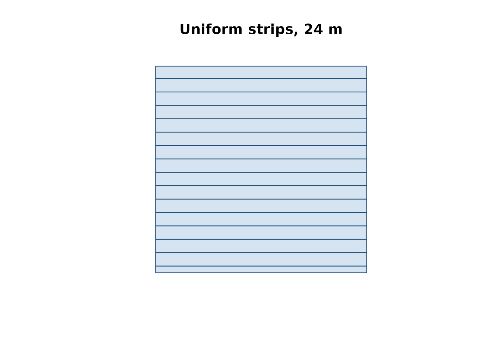

# Farm-level balance and strip-prescription map

This vignette walks through the end-to-end workflow that NFert v0.13
supports:

1.  Load a farm layout (GeoJSON) with per-plot agronomic inputs.
2.  Run the DPI-2026 N balance on every plot.
3.  Build a machine-width strip prescription map for one plot.
4.  Export the prescription in the formats accepted by the on-board
    monitor of the target tractor (Shapefile, ISOXML TASKDATA.XML, John
    Deere / Trimble flavours, etc.).

## 1. Load the demo farm

The package ships with a fictitious 35.5 ha farm near Piacenza with 8
plots carrying all the columns required by
[`N_balance()`](https://mcroci.github.io/NFert/reference/N_balance.md):

``` r

library(NFert)
library(sf)
ex   <- system.file("extdata/example_farm.geojson", package = "NFert")
farm <- sf::st_read(ex, quiet = TRUE)
farm[, c("plot_id", "plot_name", "crop", "area_ha")]
#> Simple feature collection with 8 features and 4 fields
#> Geometry type: POLYGON
#> Dimension:     XY
#> Bounding box:  xmin: 9.7122 ymin: 45.048 xmax: 9.7257 ymax: 45.05645
#> Geodetic CRS:  WGS 84
#>   plot_id      plot_name                           crop area_ha
#> 1     P01   Campo Grande       Silage maize (class 700)     5.2
#> 2     P02   Poplar Strip Soft wheat FF - strong (grain)     3.4
#> 3     P03    Lower Ditch    Grain maize 500-700 (grain)     7.8
#> 4     P04 Dovecote Field                Soybean (grain)     2.1
#> 5     P05     Old Meadow                        Alfalfa     4.5
#> 6     P06      Riverbank       Silage maize (class 500)     6.0
#> 7     P07       New Barn            Durum wheat (grain)     3.7
#> 8     P08  Woodlot Field                 Barley (grain)     2.8
#>                         geometry
#> 1 POLYGON ((9.715 45.048, 9.7...
#> 2 POLYGON ((9.7187 45.048, 9....
#> 3 POLYGON ((9.7215 45.048, 9....
#> 4 POLYGON ((9.7125 45.051, 9....
#> 5 POLYGON ((9.7122 45.0535, 9...
#> 6 POLYGON ((9.7185 45.0512, 9...
#> 7 POLYGON ((9.7222 45.0512, 9...
#> 8 POLYGON ((9.7155 45.0542, 9...
```

## 2. Per-plot N balance

[`farm_balance()`](https://mcroci.github.io/NFert/reference/farm_balance.md)
applies
[`N_balance()`](https://mcroci.github.io/NFert/reference/N_balance.md)
to every feature and appends `N_target`, `MAS_cap`, `MAS_ok` and
`N_total_kg` to the layer. Italian legacy strings are accepted in input
and translated on the fly.

``` r

farm_out <- farm_balance(farm)
farm_out[, c("plot_id", "crop", "N_target", "MAS_cap",
             "MAS_ok", "N_total_kg")]
#> Simple feature collection with 8 features and 6 fields
#> Geometry type: POLYGON
#> Dimension:     XY
#> Bounding box:  xmin: 9.7122 ymin: 45.048 xmax: 9.7257 ymax: 45.05645
#> Geodetic CRS:  WGS 84
#>   plot_id                           crop N_target MAS_cap MAS_ok N_total_kg
#> 1     P01       Silage maize (class 700)    226.1     340   TRUE     1175.7
#> 2     P02 Soft wheat FF - strong (grain)    209.9     200  FALSE      713.7
#> 3     P03    Grain maize 500-700 (grain)    222.9     260   TRUE     1738.6
#> 4     P04                Soybean (grain)     55.5      NA  FALSE      116.6
#> 5     P05                        Alfalfa      0.0      NA  FALSE        0.0
#> 6     P06       Silage maize (class 500)    234.2      NA  FALSE     1405.2
#> 7     P07            Durum wheat (grain)    167.6     200   TRUE      620.1
#> 8     P08                 Barley (grain)    147.0     180   TRUE      411.6
#>                         geometry
#> 1 POLYGON ((9.715 45.048, 9.7...
#> 2 POLYGON ((9.7187 45.048, 9....
#> 3 POLYGON ((9.7215 45.048, 9....
#> 4 POLYGON ((9.7125 45.051, 9....
#> 5 POLYGON ((9.7122 45.0535, 9...
#> 6 POLYGON ((9.7185 45.0512, 9...
#> 7 POLYGON ((9.7222 45.0512, 9...
#> 8 POLYGON ((9.7155 45.0542, 9...
```

## 3. Strip prescription along an A-B line

[`build_strip_prescription()`](https://mcroci.github.io/NFert/reference/build_strip_prescription.md)
tiles one plot with parallel strips of a user-supplied working width. If
no A-B line is given, the longest side of the field is used as driving
direction. Dose variability can be driven by a uniform target, a VI
calibration curve, NNI zones, or quantile classes.

``` r

field <- farm[1, ]          # Campo Grande, 5.2 ha silage maize

# Option A: uniform 226 kg N/ha (from the balance), 24 m spreader
rx_uni <- build_strip_prescription(
  field         = field,
  machine_width = 24,
  variability   = "uniform",
  n_target      = 226)

plot(sf::st_geometry(rx_uni), col = "#D5E4F0",
     border = "#1F4E79", main = "Uniform strips, 24 m")
```



Swapping in a VI calibration curve makes the dose decrease with vigour;
the mean across the field is preserved (mass-balance constraint) by
default.

``` r

# Option B: VI calibration (requires an NDVI raster)
rx_cal <- build_strip_prescription(
  field         = field,
  machine_width = 24,
  variability   = "calibration",
  vi_raster     = my_ndvi_raster,
  n_target      = 226,
  min_dose      = 80,  max_dose = 260,
  vi_low        = 0.35, vi_high = 0.80)
```

A 2-D **grid** (variable dose cell-by-cell) is produced by passing
`cell_length > 0`; an explicit A-B direction is set with `angle_deg`
(degrees, 0 = east, 90 = north) or by supplying an `sf` LINESTRING in
`ab_line`:

``` r

# Option C: 24 m working width x 50 m along-strip cells, AB = 30 deg
rx_grid <- build_strip_prescription(
  field         = field,
  machine_width = 24,
  cell_length   = 50,
  angle_deg     = 30,
  variability   = "classes",
  vi_raster     = my_ndvi_raster,
  n_target      = 226,
  min_dose      = 80, max_dose = 260,
  n_classes     = 5)

# Option D: NNI-driven zones
rx_nni <- build_strip_prescription(
  field         = field,
  machine_width = 24,
  cell_length   = 0,           # continuous strips
  variability   = "nni",
  nni_raster    = my_nni_map,
  n_target      = 226,
  min_dose      = 80, max_dose = 260,
  thr_lo        = 0.90, thr_hi = 1.10)
```

## 4. Export to tractor-ready formats

[`export_prescription()`](https://mcroci.github.io/NFert/reference/export_prescription.md)
writes a single file;
[`export_prescription_all()`](https://mcroci.github.io/NFert/reference/export_prescription_all.md)
bundles several formats in one output folder.

``` r

export_prescription(rx_uni, "rx.shp",       format = "shp")
export_prescription(rx_uni, "JD/rx.shp",    format = "johndeere")
export_prescription(rx_uni, "TASKDATA",     format = "isoxml",
  isoxml_opts = list(task_name = "N top-dress",
                      product   = "Urea 46 pct",
                      unit      = "kg/ha"))

export_prescription_all(rx_uni, "rx_bundle", "campo_grande",
  formats = c("shp", "isoxml", "johndeere"))
```

The Shiny interface
([`NFert::run_app()`](https://mcroci.github.io/NFert/reference/run_app.md))
exposes the same flow with interactive forms and a leaflet preview.
