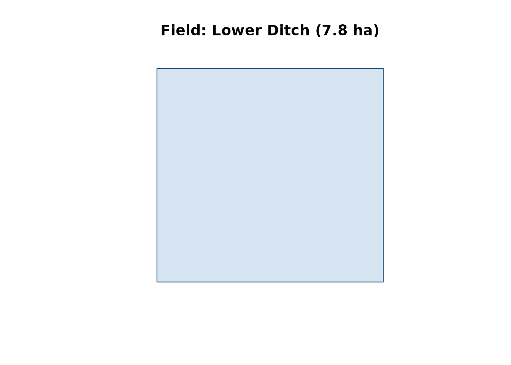
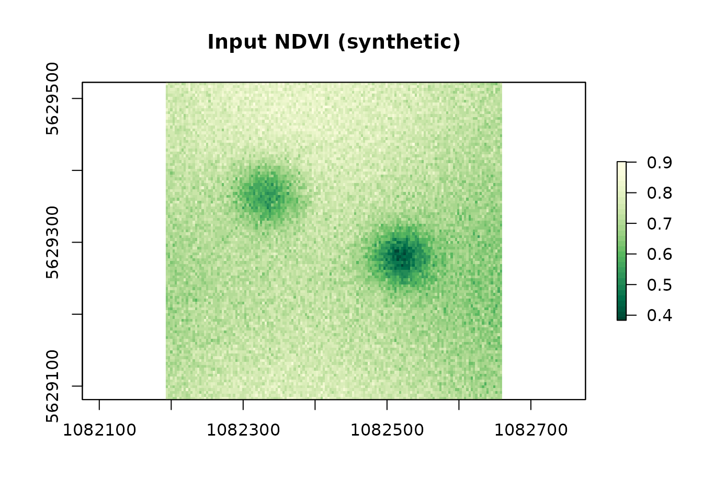
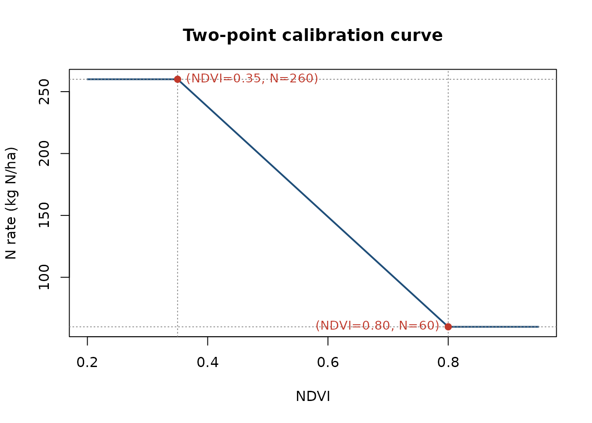
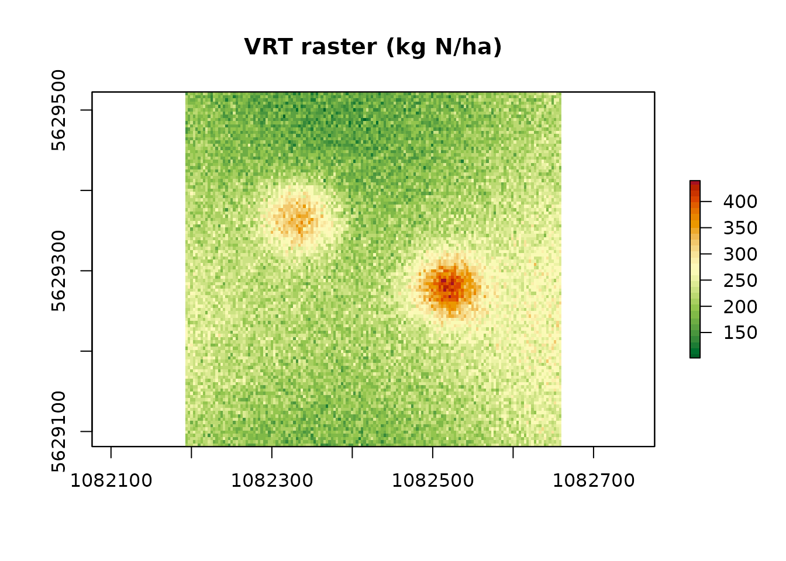
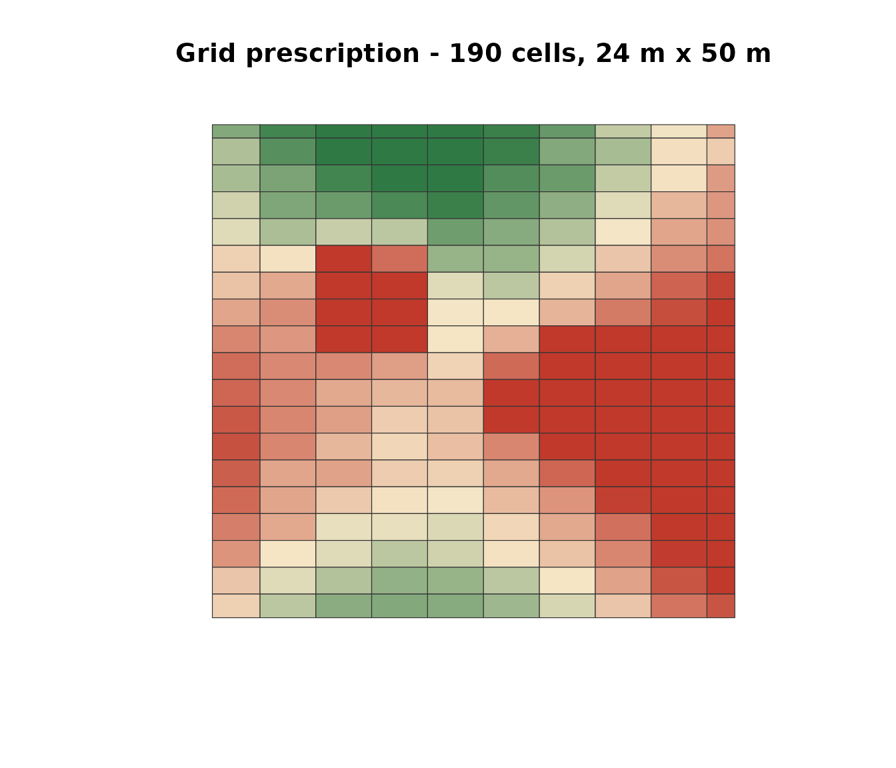
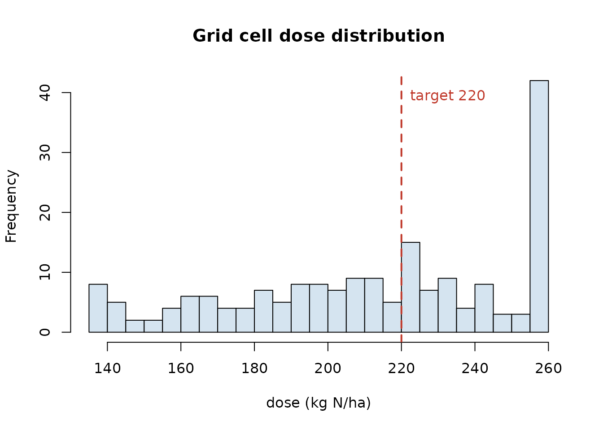

# Prescription map worked example: NDVI, calibration curve, grid

This vignette shows the **full workflow** from an NDVI raster to a
machine-width grid prescription map, in six steps:

1.  Load the field polygon (bundled demo farm).
2.  Synthesise or load an NDVI raster on that field.
3.  Define the **calibration curve** (VI -\> N rate) from two anchor
    points.
4.  Generate **Option A** - a pixel-by-pixel VRT raster with
    [`variable_rate_N()`](https://mcroci.github.io/NFert/reference/variable_rate_N.md).
5.  Generate **Option B** - a **grid prescription** with
    [`build_strip_prescription()`](https://mcroci.github.io/NFert/reference/build_strip_prescription.md)
    (machine width x cell length, along an A-B line), colour-coded by
    the same calibration.
6.  Export both as GeoTIFF / Shapefile / ISOXML.

All of this runs on the demo data that ships with NFert.

## 1. Load a field polygon

``` r

library(NFert)
library(sf)

ex   <- system.file("extdata/example_farm.geojson", package = "NFert")
farm <- sf::st_read(ex, quiet = TRUE)

# Pick plot P03 - "Lower Ditch", 7.8 ha grain maize, loamy soil
field <- farm[3, ]
field[, c("plot_id", "plot_name", "crop", "area_ha")]
#> Simple feature collection with 1 feature and 4 fields
#> Geometry type: POLYGON
#> Dimension:     XY
#> Bounding box:  xmin: 9.7215 ymin: 45.048 xmax: 9.7257 ymax: 45.0508
#> Geodetic CRS:  WGS 84
#>   plot_id   plot_name                        crop area_ha
#> 3     P03 Lower Ditch Grain maize 500-700 (grain)     7.8
#>                         geometry
#> 3 POLYGON ((9.7215 45.048, 9....
plot(sf::st_geometry(field), col = "#D5E4F0", border = "#1F4E79",
     main = sprintf("Field: %s (%.1f ha)",
                    field$plot_name, field$area_ha))
```



## 2. Synthesise (or load) an NDVI raster

In a real workflow you would read a GeoTIFF from UAV or Sentinel-2. Here
we build a plausible NDVI in one line using the internal demo helper
(same synthesiser used by the Shiny “Load demo NDVI” button):

``` r

library(raster)

# Two-patch NDVI with smooth base + noise
set.seed(7)
fp <- sf::st_transform(field, 3857)
bb <- sf::st_bbox(fp)

nx <- 150
ny <- 110
r  <- raster(xmn = bb$xmin, xmx = bb$xmax,
             ymn = bb$ymin, ymx = bb$ymax,
             ncols = nx, nrows = ny, crs = 3857)

x  <- seq(0, 1, length.out = nx); y <- seq(0, 1, length.out = ny)
gx <- matrix(x, nrow = ny, ncol = nx, byrow = TRUE)
gy <- matrix(y, nrow = ny, ncol = nx)
base   <- 0.72 + 0.05 * sin(4 * gx) + 0.04 * cos(5 * gy)
patch1 <- 0.22 * exp(-(((gx - 0.30)^2 + (gy - 0.35)^2) / 0.010))
patch2 <- 0.26 * exp(-(((gx - 0.70)^2 + (gy - 0.55)^2) / 0.008))
ndvi_vals <- base - patch1 - patch2 + 0.03 * rnorm(nx * ny)
ndvi_vals <- pmin(pmax(ndvi_vals, 0.30), 0.92)
raster::values(r) <- ndvi_vals
r <- raster::mask(r, as(fp, "Spatial"))

names(r) <- "NDVI"
r
#> class      : RasterLayer 
#> dimensions : 110, 150, 16500  (nrow, ncol, ncell)
#> resolution : 3.116946, 4.010757  (x, y)
#> extent     : 1082192, 1082660, 5629081, 5629522  (xmin, xmax, ymin, ymax)
#> crs        : +proj=merc +a=6378137 +b=6378137 +lat_ts=0 +lon_0=0 +x_0=0 +y_0=0 +k=1 +units=m +nadgrids=@null +wktext +no_defs 
#> source     : memory
#> names      : NDVI 
#> values     : 0.3834043, 0.901509  (min, max)

plot(r, main = "Input NDVI (synthetic)",
     col = hcl.colors(30, "YlGn"))
```



## 3. Define the calibration curve

The **two-point linear** calibration maps an NDVI reference (lowest
vigour) to `max_dose` (to push canopy development) and a high-vigour
NDVI to `min_dose` (canopy already lush, less N needed):

``` r

# Agronomic N target from the field-scale balance (example: 220 kg N/ha
# for an 11 t/ha grain maize in Pianura Padana)
N_target <- 220
min_dose <- 60
max_dose <- 260

vi_low  <- 0.35    # anchor for max_dose
vi_high <- 0.80    # anchor for min_dose

# Plot the calibration
vi  <- seq(0.20, 0.95, length.out = 200)
slope <- (min_dose - max_dose) / (vi_high - vi_low)
intercept <- max_dose - slope * vi_low
dose_curve <- pmin(pmax(slope * vi + intercept, min_dose), max_dose)

plot(vi, dose_curve, type = "l", lwd = 2, col = "#1F4E79",
     xlab = "NDVI", ylab = "N rate (kg N/ha)",
     main = "Two-point calibration curve")
abline(v = c(vi_low, vi_high), lty = 3, col = "#888")
abline(h = c(min_dose, max_dose), lty = 3, col = "#888")
points(c(vi_low, vi_high), c(max_dose, min_dose),
       pch = 19, col = "#C0392B")
text(vi_low,  max_dose, sprintf("(NDVI=%.2f, N=%d)", vi_low, max_dose),
     pos = 4, cex = 0.9, col = "#C0392B")
text(vi_high, min_dose, sprintf("(NDVI=%.2f, N=%d)", vi_high, min_dose),
     pos = 2, cex = 0.9, col = "#C0392B")
```



## 4. Option A - pixel-by-pixel VRT raster

[`variable_rate_N()`](https://mcroci.github.io/NFert/reference/variable_rate_N.md)
applies the calibration to every pixel and rescales the output so the
area-weighted mean equals the balance target (mass-balance constraint).
With `method = "calibration"` the two anchor points are taken
automatically from the **empirical `min` / `max` of the NDVI raster**
mapped to (`maxN`, `minN`) — i.e. the lowest-vigour pixels get the
highest dose and vice-versa. If you need to fix the anchors yourself
(e.g. force them to `vi_low = 0.35` and `vi_high = 0.80` from your local
calibration), use Option B with
[`build_strip_prescription()`](https://mcroci.github.io/NFert/reference/build_strip_prescription.md)
below, which exposes them as arguments.

``` r

vr <- variable_rate_N(
  ndvi_raster = r,
  n_dose      = N_target,
  method      = "calibration",      # or "holland" for Holland & Schepers
  minN        = min_dose,
  maxN        = max_dose
)

rx_raster <- vr$rate_raster %||% vr    # robust to return shape
plot(rx_raster,
     main = "VRT raster (kg N/ha)",
     col = rev(hcl.colors(30, "RdYlGn")))
```



``` r

cat("Mean applied N:  ", round(cellStats(rx_raster, "mean", na.rm = TRUE), 1),
    "kg N/ha\n")
#> Mean applied N:   220 kg N/ha
cat("Range:           ", round(cellStats(rx_raster, "min", na.rm = TRUE), 1),
    "-", round(cellStats(rx_raster, "max", na.rm = TRUE), 1), "kg N/ha\n")
#> Range:            101.5 - 439.8 kg N/ha
```

`%||%` is just defensive code (some versions of
[`variable_rate_N()`](https://mcroci.github.io/NFert/reference/variable_rate_N.md)
return a list, others a raster directly); it is defined once at the top
of the vignette in the hidden setup chunk.

## 5. Option B - machine-width grid along an A-B line

The pixel-by-pixel raster in Option A is fine for a self-driving tractor
with a continuous-rate spreader, but many farm monitors prefer a **block
prescription**: rectangular cells of `machine_width x cell_length` with
a single dose per cell. NFert’s
[`build_strip_prescription()`](https://mcroci.github.io/NFert/reference/build_strip_prescription.md)
produces exactly that, applying the same calibration internally:

``` r

rx_grid <- build_strip_prescription(
  field         = field,
  machine_width = 24,     # metres, working width of the spreader
  cell_length   = 50,     # metres, along the A-B line (0 = continuous strips)
  angle_deg     = NULL,   # NULL = auto-detect long side; set 30 / 90 / ... to force
  variability   = "calibration",
  vi_raster     = r,
  n_target      = N_target,
  min_dose      = min_dose,
  max_dose      = max_dose,
  vi_low        = vi_low,
  vi_high       = vi_high,
  preserve_mean = TRUE)

# Plot with the dose-based palette used by the Shiny app
pal <- colorRampPalette(c("#2F7A44", "#F6E7C7", "#C0392B"))(100)
col_idx <- as.integer(round(
  (rx_grid$dose - min(rx_grid$dose, na.rm = TRUE)) /
    diff(range(rx_grid$dose, na.rm = TRUE)) * 99)) + 1
plot(sf::st_geometry(sf::st_transform(rx_grid, 3857)),
     col = pal[col_idx], border = "#333", lwd = 0.6,
     main = sprintf("Grid prescription - %d cells, 24 m x 50 m",
                    nrow(rx_grid)))
```



The **A-B direction** is inferred from the longest edge of the field
polygon. Pass `angle_deg = 45` (or any number) to force a specific
driving direction, or `ab_line = <sf LINESTRING>` to use an existing
tramline.

### Distribution of doses per grid cell

``` r

hist(rx_grid$dose, breaks = 20, col = "#D5E4F0",
     main = "Grid cell dose distribution",
     xlab = "dose (kg N/ha)")
abline(v = N_target, col = "#C0392B", lwd = 2, lty = 2)
text(N_target, par("usr")[4]*0.9,
     sprintf("target %d", N_target), pos = 4, col = "#C0392B")
```



## 6. Export to tractor-ready formats

``` r

# A) raster GeoTIFF (farm-management software, continuous)
raster::writeRaster(rx_raster, "rx_raster.tif", overwrite = TRUE)

# B) grid polygons - any format accepted by the on-board monitor
export_prescription(rx_grid, "rx_grid.shp",          format = "shp")
export_prescription(rx_grid, "JD/rx_grid.shp",       format = "johndeere")
export_prescription(rx_grid, "TRIMBLE/rx_grid.shp",  format = "trimble")
export_prescription(rx_grid, "TASKDATA",             format = "isoxml",
  isoxml_opts = list(task_name = "N top-dress",
                      product   = "Urea 46 pct",
                      unit      = "kg/ha"))

# Or every format in one zip-ready folder:
export_prescription_all(rx_grid, "rx_bundle", "campo_grande",
  formats = c("shp", "geojson", "gpkg", "isoxml",
              "johndeere", "trimble"))
```

## 7. Notes

- **Mass-balance constraint** - `preserve_mean = TRUE` (default) makes
  the area-weighted mean dose match `n_target`. The balance provides the
  legally defensible field ceiling (MAS / ZVN 170 kg N/ha), and the VRT
  / grid layer redistributes it in space.
- **Calibration sources** - the default anchors (`vi_low = 0.35`,
  `vi_high = 0.80`) work for most mid-season Sentinel-2 NDVI in Northern
  Italy. Recalibrate locally against a set of plot-level yield /
  N-status samples for operational use.
- **Cell granularity** - finer `cell_length` gives a denser grid but
  risks delivery oscillations on the spreader; 50-100 m along the A-B
  line is a reasonable default for a 24-36 m machine.
- **Same pipeline for NNI** - replace `variability = "calibration"` with
  `variability = "nni"` and pass an NNI raster (from
  [`compute_NNI_from_S2()`](https://mcroci.github.io/NFert/reference/compute_NNI_from_S2.md)
  or
  [`nni_from_vi_empirical()`](https://mcroci.github.io/NFert/reference/nni_from_vi_empirical.md))
  instead of the VI to drive the strips by nitrogen status zones
  directly.
