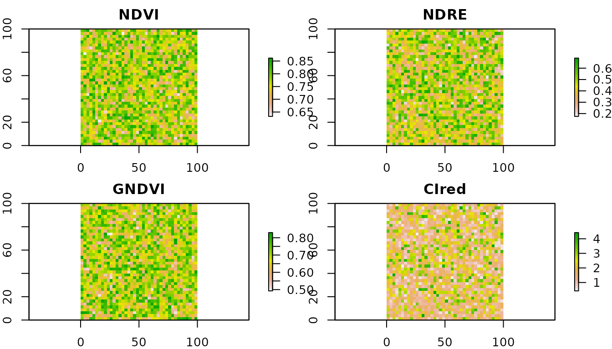
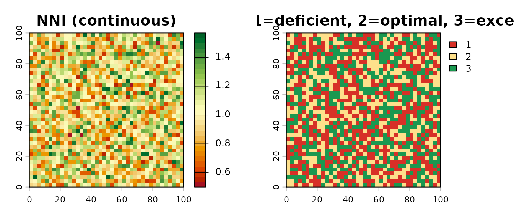
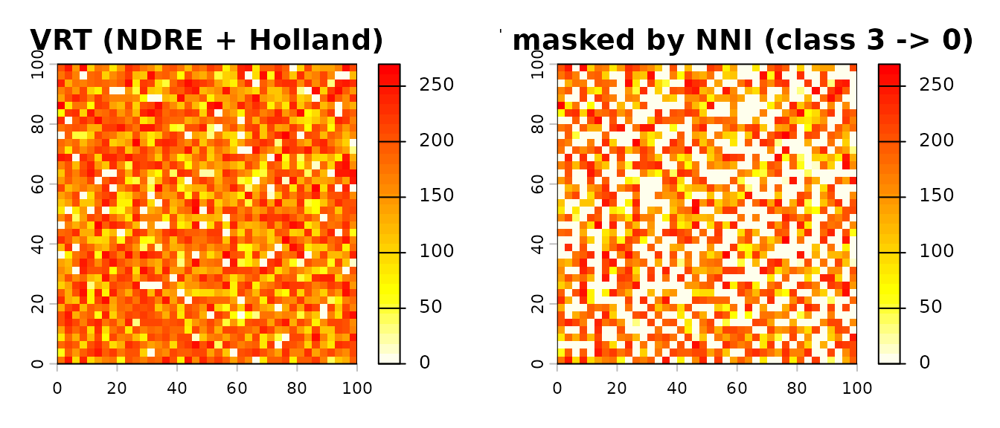

# Remote Sensing Diagnosis: multi-index VIs and Nitrogen Nutrition Index

## Overview

This vignette demonstrates the **remote-sensing diagnosis** pipeline
added in NFert 0.7.0:

1.  Compute multiple vegetation indices (VIs) from a multi-band raster
    with
    [`compute_vi()`](https://mcroci.github.io/NFert/reference/compute_vi.md).
2.  Diagnose crop nitrogen status pixel-by-pixel with
    [`compute_NNI()`](https://mcroci.github.io/NFert/reference/compute_NNI.md)
    /
    [`diagnose_N_status()`](https://mcroci.github.io/NFert/reference/diagnose_N_status.md),
    using the species-specific critical nitrogen dilution curve of
    Lemaire & Gastal (1997).
3.  Feed the diagnosis into the variable-rate prescription pipeline
    ([`variable_rate_N()`](https://mcroci.github.io/NFert/reference/variable_rate_N.md))
    so that the applied dose responds to the NNI diagnosis rather than
    to a raw vegetation index alone.

Why this matters: NDVI saturates at LAI \> 3–4. In mid- to
late-vegetative stages (GS30+ for winter wheat; V8+ for maize) red-edge
indices (NDRE, CIred-edge) are far more sensitive to canopy N status.
And all of those indices are still just **proxies**: the scientifically
correct diagnostic variable is the NNI, which uses the dilution curve to
convert biomass + N% into a dimensionless deficiency / sufficiency
index.

## 1. A synthetic multi-band stack (for the vignette)

In a real application the multi-band input comes from a Sentinel-2 L2A
scene or a UAV multispectral flight. Here we synthesise a small stack so
the vignette is reproducible offline.

``` r

library(NFert)
library(raster)
#> Loading required package: sp

set.seed(1)
template <- raster(nrows = 40, ncols = 40,
                   xmn = 0, xmx = 100, ymn = 0, ymx = 100)

# Plausible canopy reflectances (fraction 0-1)
B03 <- setValues(template, runif(ncell(template), 0.05, 0.12))  # green
B04 <- setValues(template, runif(ncell(template), 0.04, 0.08))  # red
B05 <- setValues(template, runif(ncell(template), 0.10, 0.25))  # red-edge
B08 <- setValues(template, runif(ncell(template), 0.35, 0.55))  # NIR

s2 <- stack(B03, B04, B05, B08)
names(s2) <- c("B03", "B04", "B05", "B08")
```

## 2. Multi-index VI engine

[`compute_vi()`](https://mcroci.github.io/NFert/reference/compute_vi.md)
computes any of NDVI, NDRE, GNDVI, CIred-edge, MCARI, MSAVI2 from the
stack, with configurable band mapping. Default mapping follows
Sentinel-2 L2A naming.

``` r

ndvi  <- compute_vi(s2, "NDVI")
ndre  <- compute_vi(s2, "NDRE")
gndvi <- compute_vi(s2, "GNDVI")
cire  <- compute_vi(s2, "CIred")

summary(getValues(ndvi))
#>    Min. 1st Qu.  Median    Mean 3rd Qu.    Max. 
#>  0.6329  0.7314  0.7662  0.7655  0.8055  0.8615
summary(getValues(ndre))
#>    Min. 1st Qu.  Median    Mean 3rd Qu.    Max. 
#>  0.1751  0.3596  0.4406  0.4456  0.5384  0.6886
```

``` r

par(mfrow = c(2, 2), mar = c(2, 2, 2, 3))
plot(ndvi,  main = "NDVI",  col = rev(terrain.colors(30)))
plot(ndre,  main = "NDRE",  col = rev(terrain.colors(30)))
plot(gndvi, main = "GNDVI", col = rev(terrain.colors(30)))
plot(cire,  main = "CIred", col = rev(terrain.colors(30)))
```



NDVI and GNDVI typically cluster in a narrow range for closed canopies
(saturation); NDRE and CIred-edge preserve variability at high biomass.
That is why the red-edge indices are the reference for N diagnosis in
GS30+ / V8+.

## 3. Critical-N curve

[`critical_N_curve()`](https://mcroci.github.io/NFert/reference/critical_N_curve.md)
returns the (a, b, W_min) coefficients of the species-specific critical
nitrogen dilution curve. Italian synonyms are accepted.

``` r

critical_N_curve("wheat")
#> $a
#> [1] 5.35
#> 
#> $b
#> [1] 0.44
#> 
#> $W_min
#> [1] 1.55
#> 
#> $reference
#> [1] "Justes et al. 1994"
critical_N_curve("mais")   # italian
#> $a
#> [1] 3.4
#> 
#> $b
#> [1] 0.37
#> 
#> $W_min
#> [1] 1
#> 
#> $reference
#> [1] "Plenet & Lemaire 2000"
```

The curve is Nc = a \* W^(-b), where Nc is the critical N concentration
(% DM) and W the aboveground dry biomass (t DM / ha). Defaults come from
Justes 1994 (wheat), Plenet & Lemaire 2000 (maize), Sheehy 1998 (rice),
Colnenne 1998 (rapeseed), Duru 1997 (grass), van Oosterom 2010
(sorghum), Debaeke 2012 (sunflower).

## 4. Scalar NNI diagnosis

``` r

# Winter wheat at GS30: N% = 3.2, biomass = 2.5 t DM / ha
compute_NNI(N_content = 3.2, biomass = 2.5,
            crop = "wheat", is_percent = TRUE)
#> [1] 0.8951376
# -> ~0.94 : slightly deficient

# Maize at V8: N% = 2.8, biomass = 4 t DM / ha
compute_NNI(2.8, 4, crop = "maize", is_percent = TRUE)
#> [1] 1.375439
# -> ~1.5  : luxury consumption
```

## 5. Raster-wise NNI diagnosis

In a realistic workflow biomass (W) and N concentration (N%) are both
raster layers, derived from remote sensing + empirical relationships.
Here we illustrate with two synthetic layers that emulate the output of
a biomass retrieval model + a leaf-N retrieval model.

``` r

# Synthetic biomass and N% layers
w_map <- setValues(template, runif(ncell(template), 1.5, 6.0))
n_map <- setValues(template, runif(ncell(template), 2.2, 3.9))

d <- diagnose_N_status(N_content = n_map, biomass = w_map,
                       crop = "wheat", is_percent = TRUE)

par(mfrow = c(1, 2), mar = c(3, 3, 2, 4))
plot(d$NNI,
     main = "NNI (continuous)",
     col  = hcl.colors(30, "RdYlGn"))
plot(d$class,
     main = "NNI class (1=deficient, 2=optimal, 3=excessive)",
     col  = c("#d73027", "#fee08b", "#1a9850"))
```



``` r

d$summary
#> $counts
#> $counts$deficient
#> [1] 588
#> 
#> $counts$optimal
#> [1] 465
#> 
#> $counts$excessive
#> [1] 547
#> 
#> 
#> $fractions
#> $fractions$deficient
#> [1] 0.3675
#> 
#> $fractions$optimal
#> [1] 0.290625
#> 
#> $fractions$excessive
#> [1] 0.341875
d$thresholds
#> deficient excessive 
#>       0.9       1.1
d$curve
#> $a
#> [1] 5.35
#> 
#> $b
#> [1] 0.44
#> 
#> $W_min
#> [1] 1.55
#> 
#> $reference
#> [1] "Justes et al. 1994"
```

## 6. Diagnosis-guided variable rate

The usual
[`variable_rate_N()`](https://mcroci.github.io/NFert/reference/variable_rate_N.md)
accepts any normalised VI. The diagnosis-guided upgrade is: (a) use a
red-edge index for the VRT, and (b) zero out the prescription where the
NNI diagnosis shows excessive N status, so fertiliser is not applied
where the crop is already over-supplied.

``` r

N_target <- 160   # e.g. from a preliminary N_balance()

vr <- variable_rate_N(ndre, n_dose = N_target,
                      method = "holland",
                      minN = 60, maxN = 200)
#> Warning in estimate_N_rate_from_holland_schepers(ndvi_raster = ndvi_raster, :
#> Raster projection information missing. Ensure NDVI values are in 0-1 range.

# Mask out pixels classified as "excessive" (class == 3)
rate_guided <- vr$rate_raster
rate_guided[d$class == 3] <- 0

par(mfrow = c(1, 2), mar = c(3, 3, 2, 4))
plot(vr$rate_raster,
     main = "VRT (NDRE + Holland)",
     col  = rev(heat.colors(30)))
plot(rate_guided,
     main = "VRT masked by NNI (class 3 -> 0)",
     col  = rev(heat.colors(30)))
```



``` r

cat("Full prescription  mean :",
    round(cellStats(vr$rate_raster, mean), 1), "kg/ha\n")
#> Full prescription  mean : 160 kg/ha
cat("NNI-guided        mean  :",
    round(cellStats(rate_guided, mean), 1), "kg/ha\n")
#> NNI-guided        mean  : 103.9 kg/ha
cat("N saved by NNI mask     :",
    round(cellStats(vr$rate_raster - rate_guided, mean), 1),
    "kg/ha avg, or",
    round(cellStats((vr$rate_raster - rate_guided), sum) *
          prod(res(rate_guided)) / 10000, 1),
    "kg total over the field\n")
#> N saved by NNI mask     : 56.1 kg/ha avg, or 56.1 kg total over the field
```

## 7. Empirical NNI from a single VI raster (no GPR models)

The full
[`compute_NNI_from_S2()`](https://mcroci.github.io/NFert/reference/compute_NNI_from_S2.md)
pipeline requires the 8 pyeogpr `.json` model files plus a 10-band
Sentinel-2 L2A scene. When only a single VI raster is available (UAV
NDRE, satellite NDVI, etc.), the helper
[`nni_from_vi_empirical()`](https://mcroci.github.io/NFert/reference/nni_from_vi_empirical.md)
delivers an NNI map directly through a published linear regression:

``` r

ndre <- raster::raster("ndre_field.tif")
out  <- nni_from_vi_empirical(
  ndre,
  index = "NDRE",       # or "NDVI", "CIred_edge"
  crop  = "wheat",      # wheat / maize / rice / barley
  # slope = 3.5, intercept = 0.30,  # override with local calibration
  nni_thresholds = c(0.90, 1.10))

raster::plot(out$NNI,   main = "NNI (empirical)")
raster::plot(out$zones, main = "Zones (1 deficient / 2 optimal / 3 excessive)")
```

Default slope and intercept are first-guess values from Cao 2013 (rice),
Fitzgerald 2010 and Magney 2017 (wheat), Li 2014 (maize). Local
recalibration with 30-50 plot-level ground-truth samples is strongly
recommended.

## 8. From NNI to variable-rate strips

An NNI map (from either pipeline) can drive
`build_strip_prescription(variability = "nni", ...)` to produce
machine-width strips directly exportable to any tractor monitor:

``` r

ex    <- system.file("extdata/example_farm.geojson", package = "NFert")
field <- sf::st_read(ex, quiet = TRUE)[1, ]

rx <- build_strip_prescription(
  field         = field,
  machine_width = 24,
  nni_raster    = out$NNI,
  variability   = "nni",
  n_target      = 180, min_dose = 60, max_dose = 220)

export_prescription(rx, "rx_nni.shp", format = "shp")
```

## 9. Notes and limitations

- The VIs and NNI require a **closed canopy** (W \>= W_min of the
  species-specific curve). NFert clamps W at W_min internally, but
  interpret outputs with care for early-vegetative imagery.
- [`compute_vi()`](https://mcroci.github.io/NFert/reference/compute_vi.md)
  does *not* perform cloud masking; clean the input stack beforehand
  (Sentinel-2 L2A ships a SCL layer that can be used to mask classes 3,
  8, 9, 10 and 11).
- The diagnosis-guided VRT in section 6 is a didactic example. A
  production pipeline should combine the NNI classes with the MAS cap
  ([`get_MAS()`](https://mcroci.github.io/NFert/reference/get_MAS.md))
  and the ZVN 170 kg N/ha check from
  [`plan_distribution()`](https://mcroci.github.io/NFert/reference/plan_distribution.md).

## References

Clarke, T.R. et al. (2001). Remote sensing of nitrogen status in wheat.
Proc. Beltwide Cotton Conf.

Duru, M. et al. (1997). Nitrogen nutrition status for forage grass
swards: application of the critical curve concept. Ann. Zootech. 46.

Justes, E. et al. (1994). Determination of a critical nitrogen dilution
curve for winter wheat crops. Ann. Bot. 74.

Lemaire, G. & Gastal, F. (1997). N uptake and distribution in plant
canopies. In: Diagnosis of the Nitrogen Status in Crops. Springer.

Li, F. et al. (2014). Improving estimation of summer maize nitrogen
status with red edge-based spectral vegetation indices. F. Crops Res.
157.

Plenet, D. & Lemaire, G. (2000). Relationships between dynamics of
nitrogen uptake and dry matter accumulation in maize crops. Plant Soil
216.

## Session info

``` r

sessionInfo()
#> R version 4.6.0 (2026-04-24)
#> Platform: x86_64-pc-linux-gnu
#> Running under: Ubuntu 24.04.4 LTS
#> 
#> Matrix products: default
#> BLAS:   /usr/lib/x86_64-linux-gnu/openblas-pthread/libblas.so.3 
#> LAPACK: /usr/lib/x86_64-linux-gnu/openblas-pthread/libopenblasp-r0.3.26.so;  LAPACK version 3.12.0
#> 
#> locale:
#>  [1] LC_CTYPE=C.UTF-8       LC_NUMERIC=C           LC_TIME=C.UTF-8       
#>  [4] LC_COLLATE=C.UTF-8     LC_MONETARY=C.UTF-8    LC_MESSAGES=C.UTF-8   
#>  [7] LC_PAPER=C.UTF-8       LC_NAME=C              LC_ADDRESS=C          
#> [10] LC_TELEPHONE=C         LC_MEASUREMENT=C.UTF-8 LC_IDENTIFICATION=C   
#> 
#> time zone: UTC
#> tzcode source: system (glibc)
#> 
#> attached base packages:
#> [1] stats     graphics  grDevices utils     datasets  methods   base     
#> 
#> other attached packages:
#> [1] raster_3.6-32 sp_2.2-1      NFert_0.14.0 
#> 
#> loaded via a namespace (and not attached):
#>  [1] terra_1.9-27      cli_3.6.6         knitr_1.51        rlang_1.2.0      
#>  [5] xfun_0.58         otel_0.2.0        textshaping_1.0.5 jsonlite_2.0.0   
#>  [9] htmltools_0.5.9   ragg_1.5.2        sass_0.4.10       rmarkdown_2.31   
#> [13] grid_4.6.0        evaluate_1.0.5    jquerylib_0.1.4   fastmap_1.2.0    
#> [17] yaml_2.3.12       lifecycle_1.0.5   compiler_4.6.0    codetools_0.2-20 
#> [21] fs_2.1.0          Rcpp_1.1.1-1.1    htmlwidgets_1.6.4 systemfonts_1.3.2
#> [25] lattice_0.22-9    digest_0.6.39     R6_2.6.1          bslib_0.11.0     
#> [29] tools_4.6.0       pkgdown_2.2.0     cachem_1.1.0      desc_1.4.3
```
