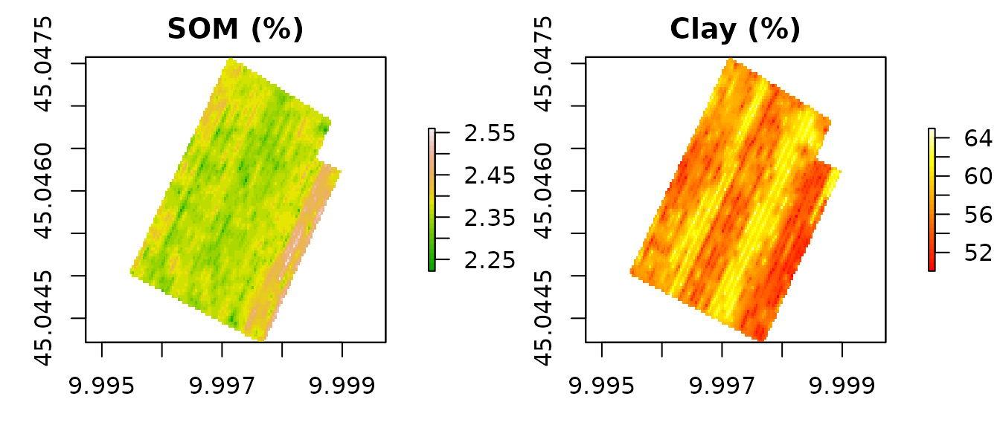
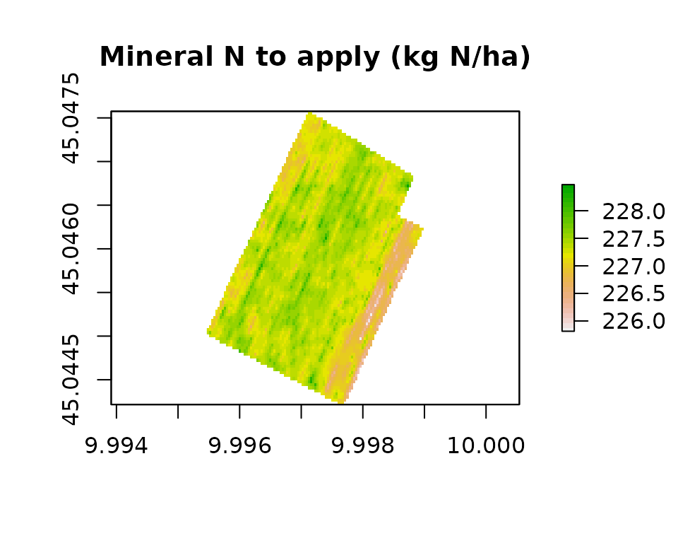
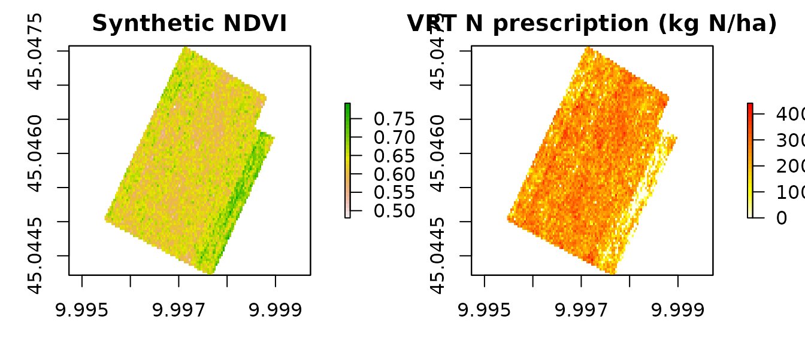

# Spatial Nitrogen Balance and Variable-Rate Prescription

## Overview

This vignette demonstrates the full NFert spatial workflow:

1.  **Load** real soil-property rasters (bundled with the package)
2.  **Compute** a spatially-explicit nitrogen balance with
    [`spatial_N_balance()`](https://mcroci.github.io/NFert/reference/spatial_N_balance.md)
3.  **Generate** a variable-rate (VRT) prescription with
    [`variable_rate_N()`](https://mcroci.github.io/NFert/reference/variable_rate_N.md)
    (Holland & Schepers method)

The workflow implements the pipeline described in Section 2.2 of the
NFert SoftwareX article: the field-scale balance provides the
regulatory-compliant N target, and the VRT functions redistribute it in
space under a mass-balance constraint.

## 1. Load the Cremonesi field rasters

NFert ships with six GeoTIFF rasters for a 12-ha arable field near
Cremona (Northern Italy), at ~3.5 m resolution: total nitrogen (TN, %),
soil organic matter (SOM, %), clay, sand and silt content (%), and the
C/N ratio.

``` r
library(NFert)
library(raster)
#> Loading required package: sp

ext <- system.file("extdata", package = "NFert")

# Read individually: the bundled GeoTIFFs may have sub-pixel extent
# mismatches from separate acquisitions, so we resample to a common
# grid (the TN raster) before stacking.
r_tn   <- raster::raster(file.path(ext, "Cremonesi_TN.tif"))
r_som  <- raster::raster(file.path(ext, "Cremonesi_SOM.tif"))
r_clay <- raster::raster(file.path(ext, "Cremonesi_Clay.tif"))
r_sand <- raster::raster(file.path(ext, "Cremonesi_Sand.tif"))
r_cn   <- raster::raster(file.path(ext, "Cremonesi_CNratio.tif"))

align <- function(r, ref) {
  if (!raster::compareRaster(r, ref, stopiffalse = FALSE)) {
    r <- raster::resample(r, ref, method = "bilinear")
  }
  r
}
soil <- raster::stack(r_tn,
                      align(r_som,  r_tn),
                      align(r_clay, r_tn),
                      align(r_sand, r_tn),
                      align(r_cn,   r_tn))
names(soil) <- c("TN", "SOM", "Clay", "Sand", "CNratio")

soil
#> class      : RasterStack 
#> dimensions : 96, 101, 9696, 5  (nrow, ncol, ncell, nlayers)
#> resolution : 3.486166e-05, 3.499425e-05  (x, y)
#> extent     : 9.995467, 9.998988, 45.04422, 45.04758  (xmin, xmax, ymin, ymax)
#> crs        : +proj=longlat +datum=WGS84 +no_defs 
#> names      :      TN,     SOM,    Clay,     Sand, CNratio 
#> min values :       ?,       ?,       ?, 7.151633,       ? 
#> max values :       ?,       ?,       ?, 24.84696,       ?
```

``` r
par(mfrow = c(1, 2), mar = c(3, 3, 2, 4))
plot(soil[["SOM"]], main = "SOM (%)", col = terrain.colors(30))
plot(soil[["Clay"]], main = "Clay (%)", col = heat.colors(30))
```



## 2. Compute the spatial nitrogen balance

[`spatial_N_balance()`](https://mcroci.github.io/NFert/reference/spatial_N_balance.md)
iterates
[`N_balance()`](https://mcroci.github.io/NFert/reference/N_balance.md)
over every non-NA pixel in the stack. Agronomic and climatic parameters
(crop, yield, rainfall, previous crop, organic history) are uniform; the
spatial variability is driven by the soil rasters alone.

``` r
n_map <- spatial_N_balance(
  soil_stack            = soil,
  expected_yield_tons_ha = 60,
  crop                  = "Silage maize (class 700)",
  ccp                   = "Spring-summer crop 100-130 days",
  oxygen_availability   = "Normal",
  winter_rain           = 160,
  start_spring_rain     = 40,
  prev_crop             = "Winter cereals straw removal",
  source                = "Cattle slurry",
  fertorg_frequency     = "every year",
  location              = "Plain adjacent to urbanized areas",
  forg_quantity         = 100
)

n_map
#> class      : RasterStack 
#> dimensions : 96, 101, 9696, 10  (nrow, ncol, ncell, nlayers)
#> resolution : 3.486166e-05, 3.499425e-05  (x, y)
#> extent     : 9.995467, 9.998988, 45.04422, 45.04758  (xmin, xmax, ymin, ymax)
#> crs        : +proj=longlat +datum=WGS84 +no_defs 
#> names      :           A,           B,          C1,          C2,           D,           E,           F,        Forg,           G,  N_to_apply 
#> min values : 234.0000000,  31.9104424,  20.0000000,   0.4793168,  19.5731327,   0.0000000,   0.0000000,   0.3000000,  13.4000000, 225.8138077 
#> max values : 234.0000000,  35.6650130,  20.0000000,   0.5108526,  20.6995039,   0.0000000,   0.0000000,   0.3000000,  13.4000000, 228.4735429
```

``` r
plot(n_map[["N_to_apply"]],
     main = "Mineral N to apply (kg N/ha)",
     col = rev(terrain.colors(30)))
```



The field-average N to apply is:

``` r
cellStats(n_map[["N_to_apply"]], stat = "mean")
#> [1] 227.2872
```

## 3. Generate a synthetic NDVI raster

In a real application the NDVI raster comes from UAV or satellite
imagery. Here we simulate one correlated with SOM (higher SOM → better
canopy vigor):

``` r
set.seed(42)
som_vals <- values(soil[["SOM"]])
som_01   <- (som_vals - min(som_vals, na.rm = TRUE)) /
            diff(range(som_vals, na.rm = TRUE))
ndvi_vals <- 0.52 + 0.25 * som_01 + rnorm(length(som_01), 0, 0.025)
ndvi_vals <- pmin(pmax(ndvi_vals, 0.35), 0.85)
ndvi_vals[is.na(som_vals)] <- NA

ndvi <- raster(soil[["SOM"]])
values(ndvi) <- ndvi_vals
names(ndvi) <- "NDVI"
```

## 4. Variable-rate prescription (Holland & Schepers)

The VRT function redistributes the field-mean N target across the
NDVI-based vigor gradient, under the mass-balance constraint described
in Section 2.2 of the article:

``` r
N_target <- cellStats(n_map[["N_to_apply"]], stat = "mean")

vr <- variable_rate_N(
  ndvi_raster = ndvi,
  n_dose      = N_target,
  method      = "holland",
  minN        = 40,
  maxN        = 180
)

rx <- vr$rate_raster
```

``` r
par(mfrow = c(1, 2), mar = c(3, 3, 2, 4))
plot(ndvi, main = "Synthetic NDVI", col = rev(terrain.colors(30)))
plot(rx,   main = "VRT N prescription (kg N/ha)",
     col = rev(heat.colors(30)))
```



## 5. Verify the mass-balance constraint

The field-mean VRT rate should match the balance-based N target:

``` r
cat("Balance N target:", round(N_target, 1), "kg N/ha\n")
#> Balance N target: 227.3 kg N/ha
cat("VRT field mean:  ", round(vr$mean_kg_ha, 1), "kg N/ha\n")
#> VRT field mean:   227.3 kg N/ha
cat("VRT range:       ",
    round(vr$min_kg_ha, 1), "–",
    round(vr$max_kg_ha, 1), "kg N/ha\n")
#> VRT range:        0 – 441.2 kg N/ha
```

## 6. Export the prescription

The resulting raster can be saved as a GeoTIFF and loaded into any GIS
or farm-management software:

``` r
writeRaster(rx, "VRT_prescription_Cremonesi.tif", overwrite = TRUE)
```

## 7. Tractor-ready formats

[`export_prescription()`](https://mcroci.github.io/NFert/reference/export_prescription.md)
polygonises a raster on the fly and writes any of the seven formats
accepted by modern on-board monitors (Shapefile, GeoJSON, KML,
GeoPackage, John Deere-ready, Trimble-ready, ISOXML TASKDATA):

``` r
# Single file with auto-detected format
export_prescription(rx, "VRT_Cremonesi.shp")

# John Deere-ready (integer RATE column, WGS84)
export_prescription(rx, "JD/VRT_Cremonesi.shp", format = "johndeere")

# ISOXML TASKDATA directory
export_prescription(rx, "TASKDATA", format = "isoxml",
  isoxml_opts = list(task_name = "Cremonesi top-dress",
                      product   = "Urea 46 pct",
                      unit      = "kg/ha"))

# Or the full multi-format bundle in one shot
export_prescription_all(rx, "rx_bundle", "Cremonesi_2026",
  formats = c("shp", "isoxml", "johndeere"))
```

## 8. Machine-width strip alternative

When the field already has a defined A-B driving line, the strip builder
produces parallel polygons of the working width, each with a dose
derived from the VRT raster (or from NNI / VI directly):

``` r
# Field polygon from the same farm GeoJSON
ex    <- system.file("extdata/example_farm.geojson", package = "NFert")
field <- sf::st_read(ex, quiet = TRUE)[1, ]

rx_strip <- build_strip_prescription(
  field         = field,
  machine_width = 24,
  cell_length   = 50,      # 0 = continuous strips; 50 = 2D grid cells
  angle_deg     = NA,      # NA = use the long side automatically
  variability   = "calibration",
  vi_raster     = ndvi,
  n_target      = N_target,
  min_dose      = 40, max_dose = 180)

export_prescription_all(rx_strip, "strip_bundle", "Cremonesi_strips",
  formats = c("shp", "isoxml"))
```
